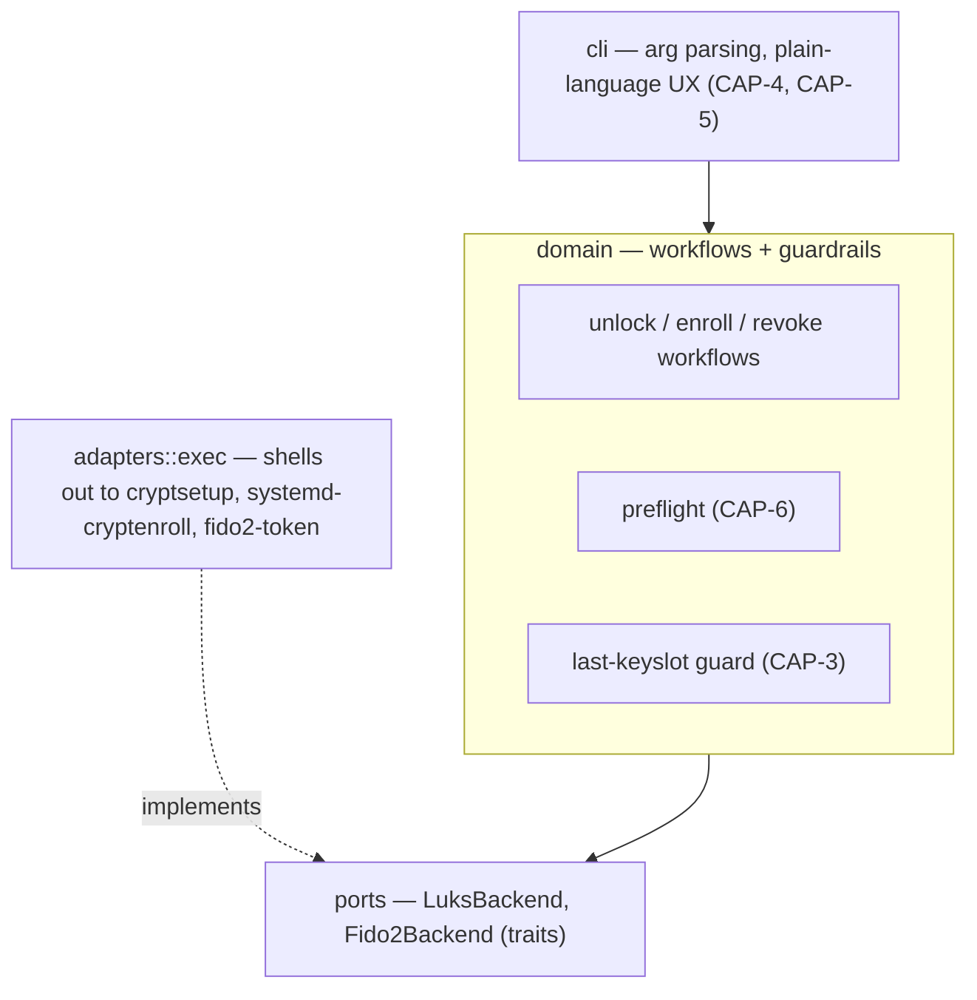
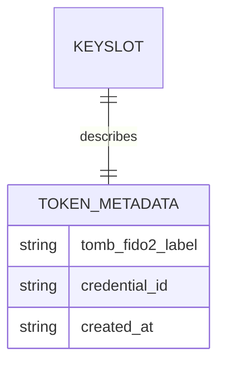

# Architecture Spine — tomb-fido2

## Design Paradigm

**Hexagonal / Ports & Adapters.** A `domain` core holds pure policy — the unlock/enroll/revoke workflows and the guardrails the underlying tools don't enforce themselves — and depends on nothing but two trait-defined ports. One `adapters::exec` implementation satisfies those ports for real by shelling out to `cryptsetup`, `systemd-cryptenroll`, and `fido2-token`. A `cli` layer sits above the domain, translating domain errors into plain-language prompts and never touching a port directly.



## Invariants & Rules

### AD-1 — Orchestrator over native crypto implementation

- **Binds:** all (CAP-1..7)
- **Prevents:** reimplementing CTAP2/hmac-secret or LUKS2 keyslot crypto from scratch; a security-sensitive, high-effort rewrite of code cryptsetup/systemd already maintain
- **Rule:** tomb-fido2 never links a crypto/FIDO2 protocol library directly. All LUKS2 and FIDO2 operations happen by invoking `cryptsetup`, `systemd-cryptenroll`, and `fido2-token` as subprocesses. The actual hmac-secret exchange and LUKS2 token handling are performed by **systemd's** `systemd-fido2` LUKS2 token plugin (`libcryptsetup-token-systemd-fido2.so`); cryptsetup itself only provides the generic plugin-loading mechanism that invokes it.

### AD-2 — No side-channel state, and token metadata reuses systemd's own token type

- **Binds:** all (CAP-1..7), especially CAP-2/CAP-3
- **Prevents:** state (key labels, slot mappings) living anywhere the break-glass procedure can't see, which would silently break recoverability once the tomb-fido2 binary is gone, or drift across machines; also prevents a custom LUKS2 token type that `cryptsetup` itself wouldn't recognize, breaking AD-1's native-auto-unlock premise
- **Rule:** tomb-fido2 persists no local sidecar file/db. Anything it must remember (per-key label, etc.) is written into the LUKS2 header itself, as an extra namespaced field (`tomb_fido2_label`) added onto the **same `systemd-fido2` token object** `systemd-cryptenroll` already creates — never a separate custom token type, which `cryptsetup`'s native FIDO2 auto-unlock would not recognize. Corollary: no volume registry — every invocation takes an explicit device/file path argument; there is no "known tombs" list anywhere.

### AD-3 — Secret material never enters tomb-fido2's own process

- **Binds:** CAP-1, CAP-2
- **Prevents:** decrypted key material, an existing LUKS passphrase, or a FIDO2 PIN persisting in tomb-fido2's process memory (SPEC's deferred memory-hygiene constraint)
- **Rule:** any subprocess invocation that may involve secret entry (existing-passphrase authentication during enroll, FIDO2 PIN prompts) runs with inherited/passthrough stdio, and `adapters::exec` never captures or pipes that data. This is always a separate subprocess call from the non-secret information-gathering calls (e.g. `fido2-token -L` to read a device's credential ID for the label) — capturing a credential ID or device list is not a secret-hygiene violation; it never happens in the same invocation as a passphrase/PIN prompt. No `zeroize`/`mlock` machinery is needed because no secret buffer exists in-process to protect.

### AD-4 — Mandatory shared pre-flight gate

- **Binds:** CAP-6, and transitively CAP-1/2/3
- **Prevents:** each workflow growing its own ad hoc, inconsistent dependency check, so some path skips verification and fails mid-operation instead of cleanly beforehand
- **Rule:** one `domain::preflight` check (LUKS2 FIDO2/hmac-secret support, required binaries present, kernel/hidraw features) runs as the *first statement* inside each `domain::workflows::*` function itself — not merely a convention enforced at the `cli` call site, which a future caller of the domain layer could bypass. No mutating call proceeds unless it passes.

### AD-5 — Last-keyslot guard lives in the domain, not in cryptsetup

- **Binds:** CAP-3
- **Prevents:** self-lockout — raw `cryptsetup` permits removing the last valid keyslot; tomb-fido2 must not. Also prevents the guard being satisfiable "by the letter" while missing its point: a stale `systemd-fido2` token pointing at an already-gone keyslot must never be counted as a live key, since that would let the guard overcount and permit lockout.
- **Rule:** a "valid keyslot" is defined as a live LUKS2 keyslot that has an associated `systemd-fido2` token — counted by querying cryptsetup's live header state (`cryptsetup luksDump`/token listing) immediately before the revoke decision, never from a cached or prior view. `domain::workflows::revoke` aborts with a clear explanation if that count is `<= 1`, before any mutating adapter call. When revoking, the token metadata is removed **first**, the keyslot **second** — this ordering guarantees that an interruption between the two steps lands in the safe dangling state (an already-unusable orphaned keyslot) rather than the dangerous one (a stale token that could make a later count overcount live keys).

### AD-6 — Scope fences: no fallback auth, no backup awareness, fixed key-presence timing

- **Binds:** all (CAP-1..7)
- **Prevents:** silent feature creep re-adding exactly what the SPEC rules out: a recovery-passphrase/keyfile escape hatch, backup/replication logic bleeding into the tool, or a configuration knob for physical key-presence timing
- **Rule:** the CLI surface never exposes a command to enroll or unlock via a non-FIDO2 method — no passphrase or keyfile enrollment capability exists in the code at all (bare `cryptsetup` remains the *only* way to do this, deliberately, for break-glass use). No module, flag, or prompt references backup, replication, or sync — the README may carry a 3-2-1 disclaimer as prose only. Physical key-presence timing at unlock is never configurable — it is exactly and only what cryptsetup's FIDO2 token mode natively provides.

### AD-7 — Testing strategy: mocked unit tests + hardware-gated integration suite

- **Binds:** all (CAP-1..7)
- **Prevents:** CI either requiring physical FIDO2 hardware (blocking automation entirely) or, at the other extreme, shipping with zero verification of the real cryptsetup/systemd-cryptenroll/fido2-token integration; also prevents each test file hand-rolling its own inconsistent fake port
- **Rule:** `domain` workflows and guardrails are unit-tested against one shared fake implementation of `LuksBackend`/`Fido2Backend` (a dedicated test-support module), run in default CI on every change. A separate integration suite exercises the real `adapters::exec` against real `cryptsetup`/`systemd-cryptenroll`/`fido2-token` and an actual FIDO2 device; it is excluded from default CI and run manually/locally when hardware is available (e.g. `make test-hardware`).

## Consistency Conventions

| Concern | Convention |
| --- | --- |
| Naming (entities, files, interfaces, events) | `domain::workflows::{unlock,enroll,revoke}`; ports `LuksBackend`, `Fido2Backend`; adapter module `adapters::exec` |
| Data & formats (ids, dates, error shapes, envelopes) | Per-key label + metadata stored as JSON in the LUKS2 token slot (schema below); domain errors are a typed enum (`thiserror`), translated to plain-language text only at the `cli` boundary — never inside `domain` |
| State & cross-cutting (mutation, errors, logging, config, auth) | No side-channel state (AD-2); no persistent logging/telemetry — stderr-only, ephemeral, human-facing output; no config file (behavior is driven by CLI args only, keeping the tool fully break-glass-independent) |

## Stack

<!-- Snapshot verified 2026-07-22 (web + local toolchain check) — re-resolve against Cargo.lock at build time, not a hard pin. -->

| Name | Version |
| --- | --- |
| Rust (rustc/cargo) | 1.90.0 — verified local toolchain/MSRV floor, not bleeding-edge-current |
| clap (CLI parsing) | 4.6.2 |
| serde + serde_json (token JSON schema) | 1.0.228 |
| thiserror (domain error types) | 2.0.18 |
| anyhow (cli-layer error plumbing) | 1.0.103 |
| cargo-dist (release binary packaging) | ~0.32.x (axodotdev/cargo-dist) |
| release-please (versioning/changelog automation) | current (googleapis/release-please, Rust manifest support) |
| cryptsetup (external, invoked) | 2.8.6 verified locally; requires LUKS2 + FIDO2 token-plugin support |
| systemd-cryptenroll (external, invoked) | systemd 261 verified locally (`+FIDO2 +LIBCRYPTSETUP_PLUGINS`) — owns the `systemd-fido2` token plugin (AD-1) |
| fido2-token / libfido2 (external, invoked) | 1.17.0 verified locally |
| Platform | Linux only (hard dependency on cryptsetup/systemd/hidraw) |
| Dev environment | Nix flake devShell (`flake.nix`, nixpkgs-unstable + flake-utils) — Rust toolchain + cryptsetup/systemd/libfido2, kept out of the contributor's system profile |

## Structural Seed

```text
tomb-fido2/
  src/
    domain/
      workflows/       # unlock.rs, enroll.rs, revoke.rs — pure policy, port-only deps, preflight-first (AD-4)
      preflight.rs      # CAP-6 shared gate (AD-4)
      errors.rs         # typed domain error enum
    ports/
      luks_backend.rs   # trait: open/close/add_key/remove_key(token-then-keyslot order, AD-5)/list_fido2_keyslots
      fido2_backend.rs  # trait: device discovery, capability probe, credential id lookup (non-secret, AD-3)
    adapters/
      exec/             # real subprocess implementation of both ports (AD-1, AD-2, AD-3)
    cli/
      main.rs           # clap definitions, dispatch to domain workflows
      ux.rs             # domain-error -> plain-language translation (CAP-5)
  tests/
    unit/               # fake LuksBackend/Fido2Backend, runs in default CI (AD-7)
    hardware/            # real adapters + real device, manual-only (AD-7, `make test-hardware`)
  Makefile              # `make build` -> cargo build --release; `make test`; `make test-hardware`
  flake.nix / flake.lock # Nix devShell: Rust toolchain + cryptsetup/systemd/libfido2, no system-wide install
  README.md             # capability docs + break-glass bare-cryptsetup procedure
```

Token JSON metadata (stored in the LUKS2 header via cryptsetup's token slot, per AD-2):



## Capability → Architecture Map

| Capability / Area | Lives in | Governed by |
| --- | --- | --- |
| CAP-1 (unlock) | `domain::workflows::unlock`, `adapters::exec` | AD-1, AD-3, AD-4 |
| CAP-2 (enroll) | `domain::workflows::enroll`, `adapters::exec` | AD-1, AD-2, AD-3, AD-4 |
| CAP-3 (revoke) | `domain::workflows::revoke` | AD-2, AD-4, AD-5, AD-6 |
| CAP-4 (unified CLI) | `cli/` | Design Paradigm (cli/domain separation) |
| CAP-5 (plain-language UX) | `cli::ux` | Design Paradigm; Consistency Conventions (error translation boundary) |
| CAP-6 (pre-flight dependency check) | `domain::preflight` | AD-4 |
| CAP-7 (raw device + loop file) | `adapters::exec` | AD-1 (device/file path passed through opaquely to cryptsetup, no branching) |
| Constraints: no fallback auth, no backup awareness, fixed key-presence timing | `cli/` (surface never exposes it), README (disclaimer only) | AD-6 |
| Constraint: verify all dependencies before any operation | `domain::preflight` | AD-4 |
| Constraint: best-effort in-memory secret hygiene | `adapters::exec` (stdio policy) | AD-3 |

## Deferred

- Distro packaging (AUR, deb, etc.) beyond GitHub Releases prebuilt binaries + `cargo build --release` — revisit once the project is public and there's demand.
- FIDO2 PIN-required-device UX specifics (detection, prompt wording) — implementation detail within `adapters::exec` / `cli::ux`, not an architectural fork.
- Concurrent tomb-fido2 invocations against the same device — not addressed; low-likelihood for a single-user cold-storage tool, revisit if it ever becomes multi-operator.
