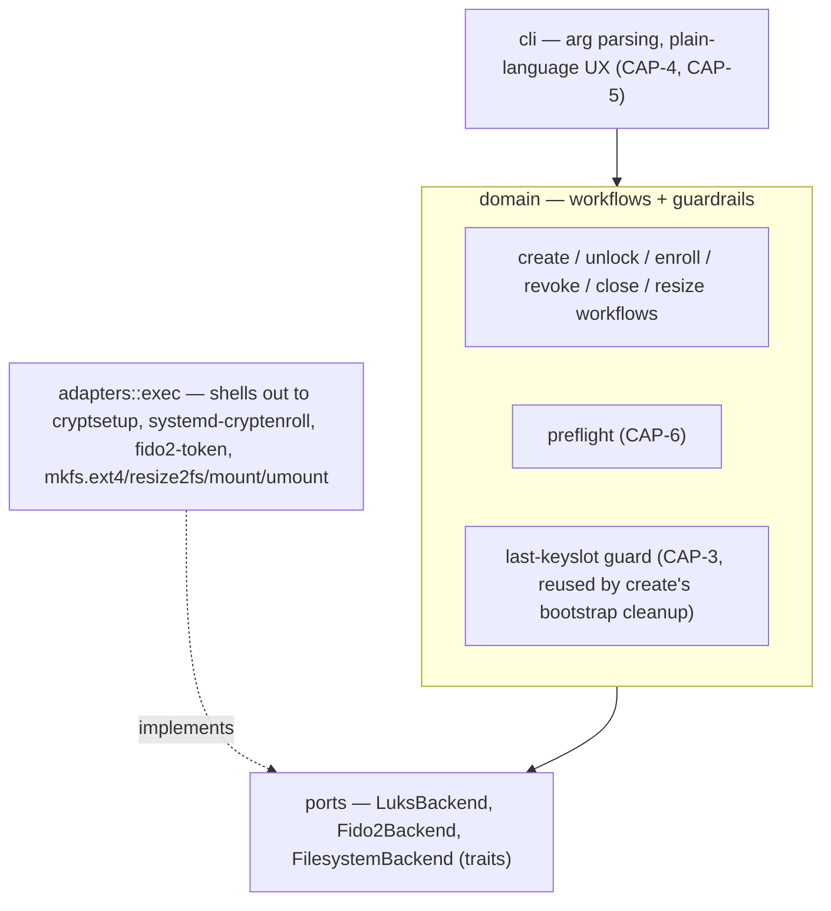
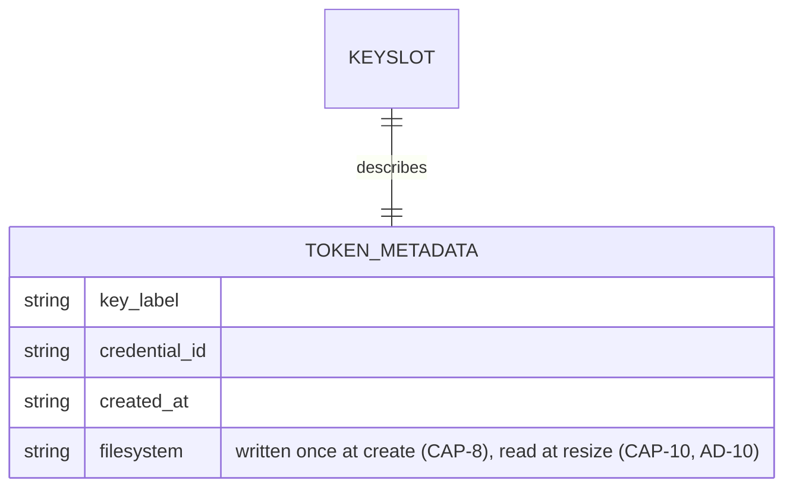

# Architecture Spine — tomb-fido2

> Working title `tomb-fido2` is a placeholder pending a permanent name — see SPEC.md Constraints. Retained throughout this document for continuity (AD-13); only implementation identifiers (CLI/binary name, package name, on-disk field names) must not hardcode it.

## Design Paradigm

**Hexagonal / Ports & Adapters.** A `domain` core holds pure policy — the create/unlock/enroll/revoke/close/resize workflows and the guardrails the underlying tools don't enforce themselves — and depends on nothing but three trait-defined ports. One `adapters::exec` implementation satisfies those ports for real by shelling out to `cryptsetup`, `systemd-cryptenroll`, `fido2-token`, and standard filesystem tooling (`mkfs.ext4`, `resize2fs`, `mount`/`umount`). A `cli` layer sits above the domain, translating domain errors into plain-language prompts and never touching a port directly.



## Invariants & Rules

### AD-1 — Orchestrator over native crypto implementation

- **Binds:** all (CAP-1..11)
- **Prevents:** reimplementing CTAP2/hmac-secret or LUKS2 keyslot crypto from scratch; a security-sensitive, high-effort rewrite of code cryptsetup/systemd already maintain
- **Rule:** tomb-fido2 never links a crypto/FIDO2 protocol library directly. All LUKS2 and FIDO2 operations happen by invoking `cryptsetup`, `systemd-cryptenroll`, and `fido2-token` as subprocesses. The actual hmac-secret exchange and LUKS2 token handling are performed by **systemd's** `systemd-fido2` LUKS2 token plugin (`libcryptsetup-token-systemd-fido2.so`); cryptsetup itself only provides the generic plugin-loading mechanism that invokes it.

### AD-2 — No side-channel state, and token metadata reuses systemd's own token type

- **Binds:** all (CAP-1..11), especially CAP-2/CAP-3/CAP-10
- **Prevents:** state (key labels, slot mappings, filesystem type) living anywhere the break-glass procedure can't see, which would silently break recoverability once the tomb-fido2 binary is gone, or drift across machines; also prevents a custom LUKS2 token type that `cryptsetup` itself wouldn't recognize, breaking AD-1's native-auto-unlock premise
- **Rule:** tomb-fido2 persists no local sidecar file/db. Anything it must remember (per-key label, the tomb's filesystem type, etc.) is written into the LUKS2 header itself, as extra fields (`key_label`, `credential_id`, `created_at`, `filesystem`) added onto the **same `systemd-fido2` token object** `systemd-cryptenroll` already creates — never a separate custom token type, which `cryptsetup`'s native FIDO2 auto-unlock would not recognize, and never prefixed with the product's own (placeholder) name (AD-13). `credential_id` is read (non-secret, AD-3) from the FIDO2 device at enroll/create time so `revoke` can display which physical key a keyslot belongs to; `created_at` is stamped at enroll/create time and displayed alongside `key_label` at revoke-time listing, purely informational, read by no workflow's logic. `filesystem` is written once by `create` and read by `resize` to select the right growfs tool, never re-asked of the user or sniffed via `blkid`. Corollary: no volume registry — every invocation takes an explicit device/file path argument; there is no "known tombs" list anywhere. **Open item:** whether cryptsetup's `systemd-fido2` token plugin tolerates unknown extra JSON fields on its own token, or validates strictly enough to reject them, is not yet confirmed — resolve with a throwaway `cryptsetup token export`/`import` spike before CAP-2/CAP-8 implementation. **Fallback if rejected:** write a second, sibling LUKS2 token of a distinct custom type referencing the same keyslot number — still inside the LUKS2 header, still no sidecar file, so this AD's no-side-channel-state guarantee holds either way.

### AD-3 — Secret material never enters tomb-fido2's own process, except one bounded bootstrap exception

- **Binds:** CAP-1, CAP-2, CAP-8
- **Prevents:** decrypted key material, an existing LUKS passphrase, or a FIDO2 PIN persisting in tomb-fido2's process memory (SPEC's deferred memory-hygiene constraint); prevents the one necessary exception below from quietly widening into a general excuse to buffer secrets elsewhere
- **Rule:** any subprocess invocation that may involve secret entry (existing-passphrase authentication during enroll, FIDO2 PIN prompts) runs with inherited/passthrough stdio, and `adapters::exec` never captures or pipes that data. This is always a separate subprocess call from the non-secret information-gathering calls (e.g. `fido2-token -L` to read a device's credential ID for the label) — capturing a credential ID or device list is not a secret-hygiene violation; it never happens in the same invocation as a passphrase/PIN prompt. **Bounded exception (CAP-8 create only):** `luksFormat` requires a seed keyslot and there is no user-supplied passphrase yet for a brand-new tomb, so `adapters::exec` generates one transient random passphrase in-process to bootstrap the header (see AD-9). That buffer is the one place a secret exists in tomb-fido2's memory; it must be built with `zeroize::Zeroizing` and wiped immediately after the `luksOpen` call that consumes it, before `mkfs` runs. No other code path is permitted to hold a secret buffer.

### AD-4 — Mandatory shared pre-flight gate

- **Binds:** CAP-6, and transitively CAP-1/2/3/8/9/10/11
- **Prevents:** each workflow growing its own ad hoc, inconsistent dependency check, so some path skips verification and fails mid-operation instead of cleanly beforehand
- **Rule:** one `domain::preflight` check (LUKS2 FIDO2/hmac-secret support, required binaries present including the fs tooling AD-8 needs, kernel/hidraw features) runs as the *first statement* inside each `domain::workflows::*` function itself — not merely a convention enforced at the `cli` call site, which a future caller of the domain layer could bypass. No mutating call proceeds unless it passes. This applies identically to `create`, `close`, and `resize` (three distinct functions), plus `unlock` — including its read-only variant, which is the same `domain::workflows::unlock` function (AD-11), not a separate one — none of the new workflows get a lighter gate than the original three.

### AD-5 — Last-keyslot guard lives in the domain, not in cryptsetup

- **Binds:** CAP-3, and reused (not reimplemented) by CAP-8's bootstrap cleanup
- **Prevents:** self-lockout — raw `cryptsetup` permits removing the last valid keyslot; tomb-fido2 must not. Also prevents the guard being satisfiable "by the letter" while missing its point: a stale `systemd-fido2` token pointing at an already-gone keyslot must never be counted as a live key, since that would let the guard overcount and permit lockout.
- **Rule:** a "valid keyslot" is defined as a live LUKS2 keyslot that has an associated `systemd-fido2` token — counted by querying cryptsetup's live header state (`cryptsetup luksDump`/token listing) immediately before the removal decision, never from a cached or prior view. `domain::workflows::revoke` aborts with a clear explanation if that count is `<= 1`, before any mutating adapter call. When revoking, the token metadata is removed **first**, the keyslot **second** — this ordering guarantees that an interruption between the two steps lands in the safe dangling state (an already-unusable orphaned keyslot) rather than the dangerous one (a stale token that could make a later count overcount live keys). `create`'s removal of its own transient bootstrap passphrase keyslot (AD-9) calls this same guarded primitive rather than a separate unguarded removal path, even though the count at that point (transient + newly-enrolled FIDO2 = 2) always trivially passes.

### AD-6 — Scope fences: no fallback auth, no backup awareness, fixed key-presence timing

- **Binds:** all (CAP-1..11)
- **Prevents:** silent feature creep re-adding exactly what the SPEC rules out: a recovery-passphrase/keyfile escape hatch, backup/replication logic bleeding into the tool, or a configuration knob for physical key-presence timing
- **Rule:** the CLI surface never exposes a command to enroll or unlock via a non-FIDO2 method — no passphrase or keyfile enrollment capability exists in the code at all (bare `cryptsetup` remains the *only* way to do this, deliberately, for break-glass use). The transient passphrase `create` generates internally for bootstrapping (AD-9) is not an exception to this — it is never user-facing, never accepted as input, and is destroyed within the same workflow. No module, flag, or prompt references backup, replication, or sync — the README may carry a 3-2-1 disclaimer as prose only. Physical key-presence timing at unlock is never configurable — it is exactly and only what cryptsetup's FIDO2 token mode natively provides.

### AD-7 — Testing strategy: mocked unit tests + hardware-gated integration suite

- **Binds:** all (CAP-1..11)
- **Prevents:** CI either requiring physical FIDO2 hardware (blocking automation entirely) or, at the other extreme, shipping with zero verification of the real cryptsetup/systemd-cryptenroll/fido2-token/filesystem integration; also prevents each test file hand-rolling its own inconsistent fake port
- **Rule:** `domain` workflows and guardrails are unit-tested against one shared fake implementation of `LuksBackend`/`Fido2Backend`/`FilesystemBackend` (a dedicated test-support module), run in default CI on every change. A separate integration suite exercises the real `adapters::exec` against real `cryptsetup`/`systemd-cryptenroll`/`fido2-token`/`mkfs.ext4`/`resize2fs` and an actual FIDO2 device; it is excluded from default CI and run manually/locally when hardware is available (e.g. `make test-hardware`).

### AD-8 — FilesystemBackend port, parameterized by filesystem type

- **Binds:** CAP-1, CAP-8, CAP-9, CAP-10, CAP-11
- **Prevents:** filesystem operations (`mkfs`, `growfs`, `mount`, `umount`) landing inline in `adapters::exec` with no fake, silently breaking AD-7's testing strategy; also prevents a second, inconsistent notion of "port" being invented for filesystem concerns, and prevents a v1-shaped port signature that would need a breaking change to add a second filesystem later
- **Rule:** a third port, `FilesystemBackend`, sits alongside `LuksBackend`/`Fido2Backend` with methods for `mkfs`/`growfs`/`mount`/`umount`, each taking a `Filesystem` enum parameter. v1's `adapters::exec` implements only `Filesystem::Ext4` (`mkfs.ext4`, `resize2fs`); adding a second variant later is additive — a new enum arm plus a new adapter match arm — with no change to the port signature or to `domain`. `domain::workflows::unlock` (both normal and read-only, CAP-1/CAP-11) calls `FilesystemBackend::mount` after `LuksBackend::open` succeeds; `domain::workflows::close` (CAP-9) calls `FilesystemBackend::umount` **before** `LuksBackend::close` — reversing that order would fail on a still-busy mapping.

### AD-9 — Create's two target modes, refuse/confirm gating, and bootstrap-keyslot lifecycle

- **Binds:** CAP-8
- **Prevents:** `luksFormat` having no seed keyslot at all (impossible — LUKS2 cannot be created without one); the transient bootstrap passphrase surviving anywhere past this workflow; two independent, incompatible port shapes emerging from an underspecified secret hand-off; `create` silently clobbering a foreign existing file or volume; a device-backed create proceeding without the user seeing the wipe warning, on any current or future CLI entry point; and a user-supplied device size silently exceeding the device's actual capacity
- **Rule:** `domain::workflows::create` calls `domain::preflight` first (AD-4), then takes one `CreateTarget` enum argument — never a flat signature with optional/overlapping fields for both modes — so the confirmation requirement below is enforced at the type level, not just in prose, and no compliant implementation can apply (or skip) it on the wrong branch. The CLI always resolves an explicit target mode (file vs. device — never inferred by sniffing the path) into the matching variant before calling `domain`:
  - **File-backed** (`CreateTarget::File { path, size }`): if `FilesystemBackend::path_exists(path)` is true, refuse before touching anything (the destination must not already exist). Otherwise call `FilesystemBackend::set_backing_file_size(path, size)` to allocate the backing file itself at the given size — no `dd`/`fallocate`/`truncate` by the user first (cf. `tomb dig`). This branch carries no confirmation field at all; there is nothing to confirm since `create` never touches a pre-existing path.
  - **Device-backed** (`CreateTarget::Device { path, size: Option<u64>, confirmed: bool }`): if `LuksBackend::has_luks2_header(path)` is true, refuse before touching anything. Otherwise resolve the size: a user-given size must not exceed `FilesystemBackend::device_capacity(path)` (rejected if it does, leaving headroom for a later CAP-10 grow when smaller); if omitted, default to that full capacity. `domain::workflows::create` refuses to proceed unless `confirmed` is `true`, regardless of whether a header was found — the field exists only on this variant (mirroring AD-11's `read_only` bool pattern), so a file-backed call has no way to carry or bypass it. The `cli` layer always renders the wipe/data-loss warning and obtains explicit user confirmation before constructing `CreateTarget::Device` with `confirmed: true`; the refusal lives in `domain` itself, not merely as a `cli`-side courtesy, so no future entry point into the domain layer can skip the prompt.

  Both modes then proceed into one atomic port method, `LuksBackend::bootstrap_format_and_open(path, size, filesystem) -> MapperHandle` (size now resolved by the branch above, letting cryptsetup constrain the LUKS2 payload on device targets), implemented entirely inside `adapters::exec`: internally it generates a random passphrase in a `zeroize::Zeroizing` buffer (the bounded exception in AD-3), runs `luksFormat` with it as the sole seed keyslot, runs `luksOpen` with the same passphrase to obtain the mapper, and wipes the buffer — the passphrase never crosses into `domain`, so no ambiguity exists about which layer owns the secret buffer. `domain` then calls `FilesystemBackend::mkfs` on the returned mapper for the user-selected `Filesystem`; enrolls the real FIDO2 key via `Fido2Backend`/`systemd-cryptenroll` as a `systemd-fido2` token+keyslot, writing `key_label` and `filesystem` (AD-2/AD-13); then removes the transient passphrase keyslot via AD-5's guarded removal primitive. **Known gap (Deferred):** a crash between `bootstrap_format_and_open` and FIDO2 enrollment/cleanup leaves an unrecoverable tomb — v1 does not support resuming a partial create.

### AD-10 — Resize ordering and grow-only enforcement

- **Binds:** CAP-10
- **Prevents:** growing the filesystem before the underlying LUKS2 mapping has the extra space (data corruption/truncation); a shrink request ever reaching `cryptsetup`/`resize2fs` given SPEC's grow-only non-goal; and a stale or interrupted-resize size reading masking a real mismatch between mapping and filesystem size
- **Rule:** `domain::workflows::resize` reads the current mapping/filesystem size live (never cached) and rejects any request smaller than that size before calling any adapter — mirroring AD-5's live-count pattern. For a file-backed tomb, it first calls `FilesystemBackend::set_backing_file_size(path, new_size)` — the same primitive AD-9's create uses to allocate the file initially — before `LuksBackend::resize` touches the LUKS2 mapping; for a raw block device/partition, tomb-fido2 does not resize the partition table — it assumes the partition is already large enough and errors clearly if not, since partition management is out of scope. Once space is confirmed, `LuksBackend` resizes the LUKS2 mapping first; only then does `FilesystemBackend::growfs` (fs type selected via the `filesystem` token field, AD-2) grow the filesystem on the now-larger mapper.

### AD-11 — Read-only unlock propagates atomically to both layers, with rollback on partial failure

- **Binds:** CAP-11
- **Prevents:** a partial implementation (e.g. a read-only filesystem mount over a still-writable dm-crypt mapping) that would satisfy a filesystem-level-only reading of "read-only" but not SPEC's explicit block-device-level requirement; a later `mount -o remount,rw` succeeding once the underlying mapper itself already refuses writes; and a dangling open mapper left behind by a failed mount
- **Rule:** a single `read_only: bool` enters `domain::workflows::unlock` from the CLI flag and is passed to both `LuksBackend::open` (`cryptsetup luksOpen --readonly`) and `FilesystemBackend::mount` (`mount -o ro`) in the same call — there is no code path that sets one without the other. If `open` succeeds but the subsequent `mount` fails, `domain::workflows::unlock` calls `LuksBackend::close` on the just-opened mapping before returning the error.

### AD-12 — Deterministic mapping name and mountpoint discovery, no registry

- **Binds:** CAP-1, CAP-9, CAP-10, CAP-11
- **Prevents:** two independently-built workflows diverging on how `close`/`resize`/a later `unlock` find the dm-crypt mapping and mount point that an earlier `unlock`/`create` set up, given AD-2 forbids any lookup registry to remember it
- **Rule:** the dm-crypt mapping name is derived deterministically from the canonicalized input device/file path (a stable hash, prefixed with a fixed constant defined once in code — kept independent of the product's own name, per AD-13) — never user-supplied, never random, never stored. Both the canonicalization step (symlink resolution via `realpath`, not lexical normalization) and the hash function are implemented once, in a single shared `domain` helper (not `adapters::exec`, since no subprocess is involved) — every workflow that needs the mapping (`create` naming it initially; `close`, `resize`, a later `unlock` reconstructing it) calls that same helper on the same path argument, never a per-workflow reimplementation, so two independently-written call sites cannot compute divergent names for the same underlying device. The mount point is not stored either: `FilesystemBackend::umount` takes the mapper device path and resolves the live mountpoint via the kernel's own mount table (e.g. `findmnt` against `/dev/mapper/<name>`), never a remembered path.

### AD-13 — Placeholder-name isolation

- **Binds:** all (CAP-1..11)
- **Prevents:** two independently-built units baking the placeholder product name (`tomb-fido2`) into on-disk field names, the mapping-name prefix, or the CLI/binary/package name, so a future rename touches a handful of scattered literals instead of one
- **Rule:** the product name is a placeholder pending a permanent choice (SPEC constraint), and no implementation identifier assumes its permanence: (1) LUKS2 token JSON field names are generic — `key_label`, `filesystem`, `credential_id`, `created_at` (AD-2) — never prefixed with the product name; (2) AD-12's mapping-name prefix is a separate fixed constant, not derived from the product name, so the two can be renamed independently; (3) the CLI binary name and any user-facing product-name string are read from exactly one source (the Cargo package name) — never duplicated as a string literal in `cli`, error messages, or elsewhere. This constraint governs implementation identifiers only; architecture and planning documents may keep referring to the project as `tomb-fido2` for continuity until renamed.

## Consistency Conventions

| Concern | Convention |
| --- | --- |
| Naming (entities, files, interfaces, events) | `domain::workflows::{create,unlock,enroll,revoke,close,resize}`; ports `LuksBackend`, `Fido2Backend`, `FilesystemBackend`; adapter module `adapters::exec` |
| Data & formats (ids, dates, error shapes, envelopes) | Per-key label + metadata stored as JSON in the LUKS2 token slot (schema below); domain errors are a typed enum (`thiserror`), translated to plain-language text only at the `cli` boundary — never inside `domain` |
| State & cross-cutting (mutation, errors, logging, config, auth) | No side-channel state (AD-2); no persistent logging/telemetry — stderr-only, ephemeral, human-facing output; no config file (behavior is driven by CLI args only, keeping the tool fully break-glass-independent) |

## Stack

<!-- Snapshot verified 2026-07-22 (web + local toolchain check) — re-resolve against Cargo.lock at build time, not a hard pin. -->

| Name | Version |
| --- | --- |
| Rust (rustc/cargo) | 1.90.0 — verified local toolchain/MSRV floor, not bleeding-edge-current |
| clap (CLI parsing) | 4.6.4 |
| serde + serde_json (token JSON schema) | 1.0.229 |
| thiserror (domain error types) | 2.0.19 |
| anyhow (cli-layer error plumbing) | 1.0.104 |
| zeroize (transient bootstrap-passphrase wipe, AD-3/AD-9 only) | 1.9.0 |
| cargo-dist (release binary packaging) | ~0.32.x (axodotdev/cargo-dist, matches current 0.32.0) |
| release-please (versioning/changelog automation) | v17.10.4 (googleapis/release-please) |
| cryptsetup (external, invoked) | 2.8.6 verified locally; requires LUKS2 + FIDO2 token-plugin support |
| systemd-cryptenroll (external, invoked) | systemd 261 verified locally (`+FIDO2 +LIBCRYPTSETUP_PLUGINS`) — owns the `systemd-fido2` token plugin (AD-1) |
| fido2-token / libfido2 (external, invoked) | 1.17.0 verified locally |
| e2fsprogs — `mkfs.ext4`, `resize2fs` (external, invoked; AD-8, v1 ext4-only) | system package, no pinned version — preflight (AD-4) checks presence, not a specific version |
| util-linux — `blockdev` (external, invoked; AD-9 `device_capacity`) | system package, no pinned version — near-universal on Linux, preflight (AD-4) checks presence |
| Platform | Linux only (hard dependency on cryptsetup/systemd/hidraw) |
| Dev environment | Nix flake devShell (`flake.nix`, nixpkgs-unstable + flake-utils) — Rust toolchain + cryptsetup/systemd/libfido2, kept out of the contributor's system profile |

## Structural Seed

```text
tomb-fido2/
  src/
    domain/
      workflows/       # create.rs, unlock.rs, enroll.rs, revoke.rs, close.rs, resize.rs — pure policy, port-only deps, preflight-first (AD-4)
      preflight.rs      # CAP-6 shared gate (AD-4)
      mapping_name.rs   # single shared canonicalize+hash helper (AD-12), called by create/close/resize/unlock
      errors.rs         # typed domain error enum
    ports/
      luks_backend.rs       # trait: bootstrap_format_and_open(size, AD-9)/has_luks2_header(AD-9)/open(read_only, AD-11, deterministic name AD-12)/close/resize/add_key/remove_key(token-then-keyslot order, AD-5)/list_fido2_keyslots
      fido2_backend.rs      # trait: device discovery, capability probe, credential id lookup (non-secret, AD-3)
      filesystem_backend.rs # trait: mkfs/growfs/mount(read_only, AD-11)/umount(mountpoint discovery via kernel mount table, AD-12)/path_exists/device_capacity/set_backing_file_size(shared by create AD-9 and resize AD-10), parameterized by Filesystem enum (AD-8)
    adapters/
      exec/             # real subprocess implementation of all three ports (AD-1, AD-2, AD-3, AD-8, AD-9); v1 Filesystem::Ext4 only (mkfs.ext4, resize2fs); device_capacity shells out to `blockdev --getsize64`
    cli/
      main.rs           # clap definitions, dispatch to domain workflows
      ux.rs             # domain-error -> plain-language translation (CAP-5)
  tests/
    unit/               # fake LuksBackend/Fido2Backend/FilesystemBackend, runs in default CI (AD-7)
    hardware/            # real adapters + real device, manual-only (AD-7, `make test-hardware`)
  Makefile              # `make build` -> cargo build --release; `make test`; `make test-hardware`
  flake.nix / flake.lock # Nix devShell: Rust toolchain + cryptsetup/systemd/libfido2/e2fsprogs, no system-wide install
  README.md             # capability docs + break-glass bare-cryptsetup procedure
```

Token JSON metadata (stored in the LUKS2 header via cryptsetup's token slot, per AD-2):



## Capability → Architecture Map

| Capability / Area | Lives in | Governed by |
| --- | --- | --- |
| CAP-1 (unlock, incl. read-only) | `domain::workflows::unlock`, `adapters::exec` | AD-1, AD-3, AD-4, AD-8, AD-11, AD-12 |
| CAP-2 (enroll) | `domain::workflows::enroll`, `adapters::exec` | AD-1, AD-2, AD-3, AD-4 |
| CAP-3 (revoke) | `domain::workflows::revoke` | AD-2, AD-4, AD-5, AD-6 |
| CAP-4 (unified CLI) | `cli/` | Design Paradigm (cli/domain separation) |
| CAP-5 (plain-language UX) | `cli::ux` | Design Paradigm; Consistency Conventions (error translation boundary) |
| CAP-6 (pre-flight dependency check) | `domain::preflight` | AD-4 |
| CAP-7 (raw device + loop file) | `adapters::exec` | AD-1 (device/file path passed through opaquely to cryptsetup/filesystem tools, no branching) |
| CAP-8 (create) | `domain::workflows::create`, `adapters::exec` | AD-1, AD-2, AD-3, AD-4, AD-5, AD-8, AD-9, AD-13 |
| CAP-9 (close) | `domain::workflows::close`, `adapters::exec` | AD-1, AD-4, AD-8, AD-12 |
| CAP-10 (resize, grow-only) | `domain::workflows::resize`, `adapters::exec` | AD-2, AD-4, AD-8, AD-10, AD-12 |
| CAP-11 (read-only unlock) | `domain::workflows::unlock`, `adapters::exec` | AD-4, AD-8, AD-11, AD-12 |
| Constraints: no fallback auth, no backup awareness, fixed key-presence timing | `cli/` (surface never exposes it), README (disclaimer only) | AD-6 |
| Constraint: verify all dependencies before any operation | `domain::preflight` | AD-4 |
| Constraint: best-effort in-memory secret hygiene | `adapters::exec` (stdio policy; transient bootstrap buffer wiped, AD-9) | AD-3 |
| Constraint: filesystem ops use only standard tools, no custom handling | `FilesystemBackend`/`adapters::exec` (`mkfs.ext4`, `resize2fs`, `mount`/`umount`, no bespoke fs code) | AD-8 |
| Constraint: product name is a placeholder, not final branding | LUKS2 token field names, mapping-name prefix constant, CLI binary/package name (single source) | AD-13 |
| Non-goal: shrinking a tomb | `domain::workflows::resize` (rejects before touching any adapter) | AD-10 |

## Deferred

- Distro packaging (AUR, deb, etc.) beyond GitHub Releases prebuilt binaries + `cargo build --release` — revisit once the project is public and there's demand.
- FIDO2 PIN-required-device UX specifics (detection, prompt wording) — implementation detail within `adapters::exec` / `cli::ux`, not an architectural fork.
- Concurrent tomb-fido2 invocations against the same device — specifically, a concurrent create/enroll/revoke racing another process's revoke could defeat AD-5's live-count guard (TOCTOU), since no invocation-level lock beyond cryptsetup's own per-operation header lock exists. Still deferred as low-likelihood for a single-user cold-storage tool; revisit if it ever becomes multi-operator.
- Filesystem types beyond ext4 — v1 supports ext4 only (user-confirmed); `FilesystemBackend`'s enum-based design (AD-8) makes adding a second type additive rather than a breaking change. Revisit when there's demand for e.g. btrfs or xfs.
- Resuming a partial/crashed `create` (AD-9) — v1 has no idempotent retry; a crash between the bootstrap open and FIDO2 enrollment/cleanup leaves an unrecoverable tomb. Not required by SPEC.md; revisit if it proves risky in practice.
