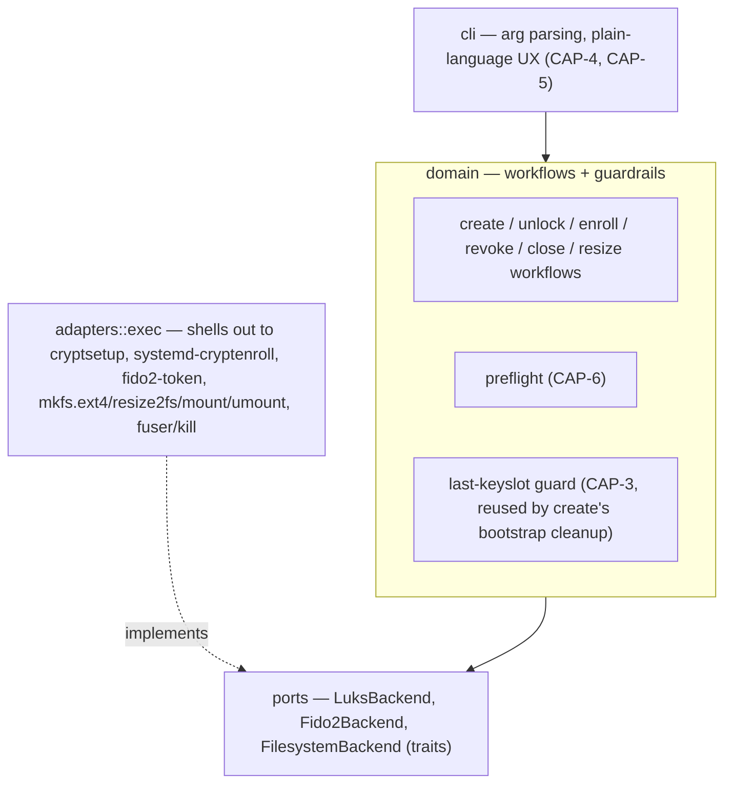
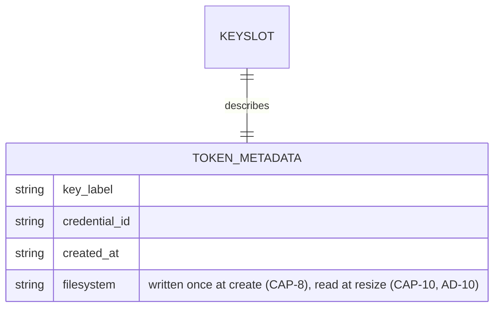

# Architecture Spine — tomb-fido2

> Working title `tomb-fido2` is a placeholder pending a permanent name — see SPEC.md Constraints. Retained throughout this document for continuity (AD-13); only implementation identifiers (CLI/binary name, package name, on-disk field names) must not hardcode it.

## Design Paradigm

**Hexagonal / Ports & Adapters.** A `domain` core holds pure policy — the create/unlock/enroll/revoke/close/resize workflows and the guardrails the underlying tools don't enforce themselves — and depends on nothing but three trait-defined ports. One `adapters::exec` implementation satisfies those ports for real by shelling out to `cryptsetup`, `systemd-cryptenroll`, `fido2-token`, and standard filesystem tooling (`mkfs.ext4`, `resize2fs`, `mount`/`umount`). A `cli` layer sits above the domain, translating domain errors into plain-language prompts and never touching a port directly.



Epic 4 (CAP-12..17) adds no new port and no new layer: `info`/`close_all`/`slam` are new `domain::workflows`; hooks (CAP-16) and busy-mount escalation (CAP-15) are new methods on the existing `FilesystemBackend`/`LuksBackend` traits (AD-14, AD-17, AD-18); progress reporting (CAP-17) is a callback `domain` invokes and `cli` supplies, the same shape as the existing error-translation boundary.

Epic 6 (CAP-18..25) likewise adds no new port and no new layer — every new capability slots onto an existing one: the invocation-locking guard (CAP-24, AD-20) and PIN-status detection (CAP-25, AD-21) both extend `FilesystemBackend`/`Fido2Backend` rather than introducing a fourth port; crash-safe create resume (CAP-23) and hook-template scaffolding (CAP-19) both amend `create`'s existing AD-9 sequence in place, closing AD-9's own documented gap rather than opening a parallel workflow.

## Invariants & Rules

### AD-1 — Orchestrator over native crypto implementation

- **Binds:** all (CAP-1..25)
- **Prevents:** reimplementing CTAP2/hmac-secret or LUKS2 keyslot crypto from scratch; a security-sensitive, high-effort rewrite of code cryptsetup/systemd already maintain
- **Rule:** tomb-fido2 never links a crypto/FIDO2 protocol library directly. All LUKS2 and FIDO2 operations happen by invoking `cryptsetup`, `systemd-cryptenroll`, and `fido2-token` as subprocesses. The actual hmac-secret exchange and LUKS2 token handling are performed by **systemd's** `systemd-fido2` LUKS2 token plugin (`libcryptsetup-token-systemd-fido2.so`); cryptsetup itself only provides the generic plugin-loading mechanism that invokes it.

### AD-2 — No side-channel state, and token metadata reuses systemd's own token type

- **Binds:** all (CAP-1..25), especially CAP-2/CAP-3/CAP-10/CAP-14/CAP-15/CAP-23
- **Prevents:** state (key labels, slot mappings, filesystem type) living anywhere the break-glass procedure can't see, which would silently break recoverability once the tomb-fido2 binary is gone, or drift across machines; also prevents a custom LUKS2 token type that `cryptsetup` itself wouldn't recognize, breaking AD-1's native-auto-unlock premise
- **Rule:** tomb-fido2 persists no local sidecar file/db. Anything it must remember (per-key label, the tomb's filesystem type, etc.) is written into the LUKS2 header itself, as extra fields (`key_label`, `credential_id`, `created_at`, `filesystem`) added onto the **same `systemd-fido2` token object** `systemd-cryptenroll` already creates — never a separate custom token type, which `cryptsetup`'s native FIDO2 auto-unlock would not recognize, and never prefixed with the product's own (placeholder) name (AD-13). `credential_id` is read (non-secret, AD-3) from the FIDO2 device at enroll/create time so `revoke` can display which physical key a keyslot belongs to; `created_at` is stamped at enroll/create time and displayed alongside `key_label` at revoke-time listing, purely informational, read by no workflow's logic. `filesystem` is written once by `create` and read by `resize` to select the right growfs tool, never re-asked of the user or sniffed via `blkid`. Corollary: no volume registry — every invocation takes an explicit device/file path argument; there is no "known tombs" list anywhere. **Open item:** whether cryptsetup's `systemd-fido2` token plugin tolerates unknown extra JSON fields on its own token, or validates strictly enough to reject them, is not yet confirmed — resolve with a throwaway `cryptsetup token export`/`import` spike before CAP-2/CAP-8 implementation. **Fallback if rejected:** write a second, sibling LUKS2 token of a distinct custom type referencing the same keyslot number — still inside the LUKS2 header, still no sidecar file, so this AD's no-side-channel-state guarantee holds either way. **Realized (Epic 6, CAP-23):** that fallback mechanism is now used for real, for an unrelated purpose — AD-9's crash-marker token is a second custom LUKS2 token type, distinct from the `systemd-fido2` token this paragraph governs. This does **not** resolve this AD's own Open item above — whether the `systemd-fido2` token itself tolerates unknown extra fields is still untested; CAP-23's marker sidesteps that question entirely by being a wholly separate token object, not an extra field on the `systemd-fido2` one.

### AD-3 — Secret material never enters tomb-fido2's own process, except one bounded bootstrap exception

- **Binds:** CAP-1, CAP-2, CAP-8, CAP-25
- **Prevents:** decrypted key material, an existing LUKS passphrase, or a FIDO2 PIN persisting in tomb-fido2's process memory (SPEC's deferred memory-hygiene constraint); prevents the one necessary exception below from quietly widening into a general excuse to buffer secrets elsewhere
- **Rule:** any subprocess invocation that may involve secret entry (existing-passphrase authentication during enroll, FIDO2 PIN prompts) runs with **stdin and stdout** inherited/passthrough, and `adapters::exec` never captures or pipes either stream. This is always a separate subprocess call from the non-secret information-gathering calls (e.g. `fido2-token -L` to read a device's credential ID for the label) — capturing a credential ID or device list is not a secret-hygiene violation; it never happens in the same invocation as a passphrase/PIN prompt. **Bounded exception (CAP-8 create only):** `luksFormat` requires a seed keyslot and there is no user-supplied passphrase yet for a brand-new tomb, so `adapters::exec` generates one transient random passphrase in-process to bootstrap the header (see AD-9). That buffer is the one place a secret exists in tomb-fido2's memory; it must be built with `zeroize::Zeroizing` and wiped immediately after the `luksOpen` call that consumes it, before `mkfs` runs. No other code path is permitted to hold a secret buffer. **Amended (Epic 6, CAP-25):** stdin/stdout stay strictly inherited for the actual secret-entry exchange, unchanged from the rule above — but **stderr** on that same subprocess call may now be piped and parsed, for non-secret diagnostic text only (a wrong-PIN retry-count warning, a PIN-required hint). Nothing captured from stderr may ever contain or derive the secret itself; if a given authenticator's diagnostic text can't be cleanly distinguished from secret material, the call falls back to this AD's original passthrough-only rule for that call. Piping stderr while stdin/stdout stay inherited on a long, touch/PIN-blocking call risks a pipe-buffer deadlock if the child writes enough stderr to fill the pipe before it's drained — the implementation must read stderr concurrently (a separate thread, or non-blocking reads interleaved with the wait) rather than reading it only after the child exits.

### AD-4 — Mandatory shared pre-flight gate

- **Binds:** CAP-6, and transitively CAP-1/2/3/8/9/10/11/12/14/15/16/18/19/22/23/24
- **Prevents:** each workflow growing its own ad hoc, inconsistent dependency check, so some path skips verification and fails mid-operation instead of cleanly beforehand
- **Rule:** one `domain::preflight` check (LUKS2 FIDO2/hmac-secret support, required binaries present including the fs tooling AD-8 needs, the hooks/process tooling AD-14/AD-18 need, kernel/hidraw features) runs as the *first statement* inside each `domain::workflows::*` function itself — not merely a convention enforced at the `cli` call site, which a future caller of the domain layer could bypass. No mutating call proceeds unless it passes. This applies identically to `create`, `close`, and `resize` (three distinct functions), plus `unlock` — including its read-only variant, which is the same `domain::workflows::unlock` function (AD-11), not a separate one — none of the new workflows get a lighter gate than the original three. Extends identically to the Epic 4 workflows: `info`, `close_all`, and `slam` (AD-17) each call `preflight` first too, even though `info` is a read-only query and `slam` intentionally skips every other confirmation — the dependency gate is orthogonal to and never waived by that.
- **Amended (Epic 6, CAP-22):** with three `Filesystem` variants now possible (AD-8), `preflight` takes an `Option<Filesystem>` and checks only the mkfs/growfs toolchain the operation actually needs (`create`/`resize` pass the requested/existing type; other workflows pass `None`, unchanged) — keeping one shared gate rather than fragmenting the filesystem-tool check into each workflow. AD-20's per-invocation lock is acquired immediately after this gate passes, never before it and never folded into it — `preflight` itself stays read-only and side-effect-free.

### AD-5 — Last-keyslot guard lives in the domain, not in cryptsetup

- **Binds:** CAP-3, and reused (not reimplemented) by CAP-8's bootstrap cleanup
- **Prevents:** self-lockout — raw `cryptsetup` permits removing the last valid keyslot; tomb-fido2 must not. Also prevents the guard being satisfiable "by the letter" while missing its point: a stale `systemd-fido2` token pointing at an already-gone keyslot must never be counted as a live key, since that would let the guard overcount and permit lockout.
- **Rule:** a "valid keyslot" is defined as a live LUKS2 keyslot that has an associated `systemd-fido2` token — counted by querying cryptsetup's live header state (`cryptsetup luksDump`/token listing) immediately before the removal decision, never from a cached or prior view. `domain::workflows::revoke` aborts with a clear explanation if that count is `<= 1`, before any mutating adapter call. When revoking, the token metadata is removed **first**, the keyslot **second** — this ordering guarantees that an interruption between the two steps lands in the safe dangling state (an already-unusable orphaned keyslot) rather than the dangerous one (a stale token that could make a later count overcount live keys). `create`'s removal of its own transient bootstrap passphrase keyslot (AD-9) calls this same guarded primitive rather than a separate unguarded removal path, even though the count at that point (transient + newly-enrolled FIDO2 = 2) always trivially passes.

### AD-6 — Scope fences: no fallback auth, no backup awareness, fixed key-presence timing

- **Binds:** all (CAP-1..25)
- **Prevents:** silent feature creep re-adding exactly what the SPEC rules out: a recovery-passphrase/keyfile escape hatch, backup/replication logic bleeding into the tool, or a configuration knob for physical key-presence timing
- **Rule:** the CLI surface never exposes a command to enroll or unlock via a non-FIDO2 method — no passphrase or keyfile enrollment capability exists in the code at all (bare `cryptsetup` remains the *only* way to do this, deliberately, for break-glass use). The transient passphrase `create` generates internally for bootstrapping (AD-9) is not an exception to this — it is never user-facing, never accepted as input, and is destroyed within the same workflow. No module, flag, or prompt references backup, replication, or sync — the README may carry a 3-2-1 disclaimer as prose only. Physical key-presence timing at unlock is never configurable — it is exactly and only what cryptsetup's FIDO2 token mode natively provides.

### AD-7 — Testing strategy: mocked unit tests + hardware-gated integration suite

- **Binds:** all (CAP-1..25) — the shared fake `LuksBackend`/`Fido2Backend`/`FilesystemBackend` gains fake implementations of every Epic 6 addition (`has_marker_token`, `lock_target`, `scaffold_hook_templates`, `client_pin`) the same day the real port method lands, never lagging behind it
- **Prevents:** CI either requiring physical FIDO2 hardware (blocking automation entirely) or, at the other extreme, shipping with zero verification of the real cryptsetup/systemd-cryptenroll/fido2-token/filesystem integration; also prevents each test file hand-rolling its own inconsistent fake port
- **Rule:** `domain` workflows and guardrails are unit-tested against one shared fake implementation of `LuksBackend`/`Fido2Backend`/`FilesystemBackend` (a dedicated test-support module), run in default CI on every change. A separate integration suite exercises the real `adapters::exec` against real `cryptsetup`/`systemd-cryptenroll`/`fido2-token`/`mkfs.ext4`/`resize2fs` and an actual FIDO2 device; it is excluded from default CI and run manually/locally when hardware is available (e.g. `make test-hardware`).

### AD-8 — FilesystemBackend port, parameterized by filesystem type

- **Binds:** CAP-1, CAP-8, CAP-9, CAP-10, CAP-11, CAP-22
- **Prevents:** filesystem operations (`mkfs`, `growfs`, `mount`, `umount`) landing inline in `adapters::exec` with no fake, silently breaking AD-7's testing strategy; also prevents a second, inconsistent notion of "port" being invented for filesystem concerns, and prevents a v1-shaped port signature that would need a breaking change to add a second filesystem later
- **Rule:** a third port, `FilesystemBackend`, sits alongside `LuksBackend`/`Fido2Backend` with methods for `mkfs`/`growfs`/`mount`/`umount`, each taking a `Filesystem` enum parameter. v1's `adapters::exec` implements only `Filesystem::Ext4` (`mkfs.ext4`, `resize2fs`); adding a second variant later is additive — a new enum arm plus a new adapter match arm — with no change to the port signature or to `domain`. **Realized (Epic 6, CAP-22):** `Filesystem` gains `Xfs` and `Btrfs` arms exactly this way — `mkfs`'s adapter match arm runs `mkfs.xfs` or `mkfs.btrfs --mixed` (unconditionally for every Btrfs volume this tool creates — dropping the minimum viable volume size from Btrfs's standard-mode ~109 MiB floor to mixed-mode's ~16 MiB, web-verified, corrected from an earlier ~114/~18 MiB estimate; upstream `btrfs-progs` docs recommend mixed mode only under roughly 1–5 GiB, warning of degraded performance/fragmentation above that — **acknowledged, not a gap:** this tool's use case is small cold-storage volumes, so `--mixed` stays unconditional by deliberate choice rather than adding a size-threshold branch nobody needs), `growfs`'s runs `xfs_growfs` or `btrfs filesystem resize`, selected the same way ext4's tools already are — read from the `filesystem` token field (AD-2), never re-asked or sniffed. `domain::workflows::unlock` (both normal and read-only, CAP-1/CAP-11) calls `FilesystemBackend::mount` after `LuksBackend::open` succeeds, then runs CAP-16's hooks step (AD-14) if applicable; `domain::workflows::close` (CAP-9) runs AD-14's hooks step first (exec-hooks and bind-hooks teardown both need the primary mount live), **then** `FilesystemBackend::umount` on the primary mountpoint, **then** `LuksBackend::close` — reversing the umount/close order would fail on a still-busy mapping. `close_all`/`slam` (AD-17/AD-18) repeat this exact same ordering once per discovered mapping, never a variant of it. Epic 4 also grows this port with hook-related methods (AD-14) and busy-mount escalation methods (AD-18) — both stay on this existing port rather than a new one, per AD-14's Rule-of-Three rationale (the authoritative statement of that call; not repeated here).

### AD-9 — Create's two target modes, refuse/resume/confirm gating, and bootstrap-keyslot lifecycle

- **Binds:** CAP-8, CAP-18, CAP-19, CAP-23
- **Prevents:** `luksFormat` having no seed keyslot at all (impossible — LUKS2 cannot be created without one); the transient bootstrap passphrase surviving anywhere past this workflow; two independent, incompatible port shapes emerging from an underspecified secret hand-off; `create` silently clobbering a foreign existing file or volume; a device-backed create proceeding without the user seeing the wipe warning, on any current or future CLI entry point; a user-supplied device size silently exceeding the device's actual capacity; a crash between bootstrap and enrollment leaving an unrecoverable tomb with no way to distinguish it from a genuine pre-existing file/volume; and hook-template scaffolding (CAP-19) landing on disk before a filesystem exists to hold it, or after the volume's already locked back up
- **Rule:** `domain::workflows::create` calls `domain::preflight` first (AD-4), then acquires AD-20's per-invocation lock, then takes one `CreateTarget` enum argument — never a flat signature with optional/overlapping fields for both modes — so the confirmation requirement below is enforced at the type level, not just in prose, and no compliant implementation can apply (or skip) it on the wrong branch. `filesystem: Filesystem`, `user_verification: bool` (AD-16), `key_label: Option<String>` (CAP-18 — falls back to today's default label when `None`), and `scaffold_hooks: bool` (CAP-19, default `false`) are all siblings to `CreateTarget` in the signature, never embedded inside it — `CreateTarget` stays scoped to AD-9's own file/device branching alone. The CLI always resolves an explicit target mode (file vs. device — never inferred by sniffing the path) into the matching variant before calling `domain`:
  - **File-backed** (`CreateTarget::File { path, size }`): if `FilesystemBackend::path_exists(path)` is `false`, proceed straight to allocation below — there is nothing to inspect. If it is `true`, the destination might be a genuine foreign file *or* this tool's own crashed partial attempt (CAP-23): call `LuksBackend::has_marker_token(path)` — `true` means a resumable partial attempt, so `create` proceeds exactly as if the path hadn't existed, **with no confirmation prompt** (the marker itself, an inert token with an empty `keyslots` array, is structural proof nothing of value survived — any other write to that path would have destroyed the LUKS2 header and the marker with it, so re-confirming would only reintroduce the friction CAP-23 exists to remove); `false` (no valid LUKS2 header at all, or one without the marker) means a genuine foreign file — refuse before touching anything, unchanged from before CAP-23. Either way, once past this gate, call `FilesystemBackend::set_backing_file_size(path, size)` to allocate (or reallocate) the backing file itself at the given size — no `dd`/`fallocate`/`truncate` by the user first (cf. `tomb dig`). This branch still carries no confirmation field of its own.
  - **Device-backed** (`CreateTarget::Device { path, size: Option<u64>, confirmed: bool }`): `has_luks2_header(path)` and (when a header is found) `has_marker_token(path)` are checked first, exactly as in the file-backed branch, to decide refuse vs. proceed vs. marker-verified resume. **Size resolution is identical and mandatory on every path that proceeds to formatting** — fresh (no header), or marker-verified resume alike: a user-given size must not exceed `FilesystemBackend::device_capacity(path)` (rejected if it does, leaving headroom for a later CAP-10 grow when smaller), defaulting to full capacity if omitted; a marker-verified resume is not exempt from this check just because it's exempt from the confirmation one below — a device shrunk since the crashed attempt must still be caught. Confirmation is the one thing that diverges by path: on the fresh (no-header) path, `domain::workflows::create` refuses to proceed unless `confirmed == true` — unchanged from before CAP-23; the `cli` layer always renders the wipe/data-loss warning and obtains explicit confirmation before constructing this variant with `confirmed: true`, and the refusal lives in `domain` itself, not merely as a `cli`-side courtesy. On the marker-verified resume path, formatting proceeds **regardless of `confirmed`'s value** — same reasoning as the file-backed branch. On the header-without-marker path, refuse before touching anything, unchanged from before CAP-23.

  Both modes then proceed into one atomic port method, `LuksBackend::bootstrap_format_and_open(path, size, filesystem) -> MapperHandle` (size now resolved by the branch above, letting cryptsetup constrain the LUKS2 payload on device targets), implemented entirely inside `adapters::exec`: internally it generates a random passphrase in a `zeroize::Zeroizing` buffer (the bounded exception in AD-3), runs `luksFormat` with it as the sole seed keyslot, **writes the CAP-23 marker token (a second, sibling LUKS2 token of a distinct custom type, empty `keyslots` array, inert at unlock — AD-2's already-documented fallback mechanism, used here for real) immediately after `luksFormat` succeeds**, runs `luksOpen` with the transient passphrase to obtain the mapper, and wipes the passphrase buffer — neither the passphrase nor the marker's presence crosses into `domain` as a secret, so no ambiguity exists about which layer owns either.

  **Real execution order past this point (matching the shipped `finish_provisioning`, correcting a drift the pre-Epic-6 spine already had backwards):** `domain` enrolls the real FIDO2 key **first** — `systemd-cryptenroll` can only add a keyslot by authenticating with a still-valid existing credential, and the transient bootstrap passphrase is the only one that exists yet — via `Fido2Backend`, writing `key_label` (CAP-18's value or the default) and `filesystem` (AD-2/AD-13); **then** calls `FilesystemBackend::mkfs` on the mapper for the user-selected `Filesystem`; **then**, if `scaffold_hooks` is `true`, mounts that same still-open mapper (`FilesystemBackend::mount`), calls `FilesystemBackend::scaffold_hook_templates(mountpoint)`, then unmounts (`FilesystemBackend::umount`) — no FIDO2 key selection is needed for this step, only the already-open mapper. Final cleanup removes the CAP-23 marker token **first**, then the transient bootstrap keyslot via AD-5's guarded removal primitive **second** — this order matters and is not arbitrary: it mirrors AD-5's own safe-ordering reasoning exactly. A crash between the two must land in the state where a future `create` at this same destination can never mistake a fully-working tomb for a resumable partial attempt — removing the marker first means a crash before keyslot cleanup leaves a stray-but-harmless transient keyslot on an already-functional tomb (annoying, not dangerous: the next `create` attempt sees `has_marker_token = false` and correctly refuses, matching the "genuine pre-existing volume" case); removing the keyslot first would instead leave the marker sitting on a fully-completed tomb, and a future `create` would read that surviving marker as "resumable" and **silently wipe a working, fully-enrolled tomb** — the actual catastrophic ordering, ruled out by this Rule.

  `scaffold_hook_templates`'s exec-hooks artifact is written as **`exec-hooks.example`, not the live `exec-hooks` filename** — AD-14's existing guardrail hard-errors `open` on any `exec-hooks` file present but not executable, so scaffolding a non-executable stub under the live name would make every scaffolded tomb fail to open until the user manually intervened, directly contradicting CAP-19's own "discoverable, not broken" intent. The user activates it by renaming and `chmod +x`-ing it themselves — consistent with "non-executable" from CAP-19's own success text. `bind-hooks`'s scaffolded content stays under the live `bind-hooks` filename since AD-14 only inspects actually-parsed entries, and a fully-commented-out file parses to zero entries — inert by content, not by name, so no renaming is needed there.

  `LuksBackend::has_marker_token(path)` is a single, self-contained check, safe to call on any path regardless of what's already been verified about it: `true` only for a path with a valid LUKS2 header carrying the marker; `false` for no header, an unreadable/invalid header, or a valid header without the marker. The file-backed branch calls it directly (its only precondition is that the path exists); the device-backed branch calls it only once `has_luks2_header` is already known `true` — a stricter caller context, not a different contract on the method itself. **Resolved (Epic 6, CAP-23):** the previously-known gap — a crash between `bootstrap_format_and_open` and FIDO2 enrollment/cleanup leaving an unrecoverable tomb — is closed by the marker-token detection above: re-running `create` against the same destination now restarts it clean instead of refusing or requiring manual cleanup.

### AD-10 — Resize ordering and grow-only enforcement

- **Binds:** CAP-10
- **Prevents:** growing the filesystem before the underlying LUKS2 mapping has the extra space (data corruption/truncation); a shrink request ever reaching `cryptsetup`/`resize2fs` given SPEC's grow-only non-goal; and a stale or interrupted-resize size reading masking a real mismatch between mapping and filesystem size
- **Rule:** `domain::workflows::resize` reads the current mapping/filesystem size live (never cached) and rejects any request smaller than that size before calling any adapter — mirroring AD-5's live-count pattern. For a file-backed tomb, it first calls `FilesystemBackend::set_backing_file_size(path, new_size)` — the same primitive AD-9's create uses to allocate the file initially — before `LuksBackend::resize` touches the LUKS2 mapping; for a raw block device/partition, tomb-fido2 does not resize the partition table — it assumes the partition is already large enough and errors clearly if not, since partition management is out of scope. Once space is confirmed, `LuksBackend` resizes the LUKS2 mapping first; only then does `FilesystemBackend::growfs` (fs type selected via the `filesystem` token field, AD-2) grow the filesystem on the now-larger mapper.

### AD-11 — Read-only unlock propagates atomically to both layers, with rollback on partial failure

- **Binds:** CAP-11
- **Prevents:** a partial implementation (e.g. a read-only filesystem mount over a still-writable dm-crypt mapping) that would satisfy a filesystem-level-only reading of "read-only" but not SPEC's explicit block-device-level requirement; a later `mount -o remount,rw` succeeding once the underlying mapper itself already refuses writes; and a dangling open mapper left behind by a failed mount
- **Rule:** a single `read_only: bool` enters `domain::workflows::unlock` from the CLI flag and is passed to both `LuksBackend::open` (`cryptsetup luksOpen --readonly`) and `FilesystemBackend::mount` (`mount -o ro`) in the same call — there is no code path that sets one without the other. If `open` succeeds but the subsequent `mount` fails, `domain::workflows::unlock` calls `LuksBackend::close` on the just-opened mapping before returning the error. **Amended (Epic 4):** this same rollback — `LuksBackend::close` (preceded by `FilesystemBackend::umount` if `mount` itself had succeeded) — also fires if AD-14's post-mount hooks step returns a hard error (a failed exec-hooks guardrail check), so a rejected hook never leaves a partially-set-up tomb mounted; a soft bind-hooks skip-with-warning is not an error and never triggers this rollback. `read_only: true` additionally forces `skip_hooks` behavior unconditionally (see AD-14) — hooks never run on a read-only unlock regardless of the caller-supplied flag, so there is nothing to roll back from on that path.

### AD-12 — Deterministic mapping name and mountpoint discovery, no registry

- **Binds:** CAP-1, CAP-9, CAP-10, CAP-11
- **Prevents:** two independently-built workflows diverging on how `close`/`resize`/a later `unlock` find the dm-crypt mapping and mount point that an earlier `unlock`/`create` set up, given AD-2 forbids any lookup registry to remember it
- **Rule:** the dm-crypt mapping name is derived deterministically from the canonicalized input device/file path (a stable hash, prefixed with a fixed constant defined once in code — kept independent of the product's own name, per AD-13) — never user-supplied, never random, never stored. Both the canonicalization step (symlink resolution via `realpath`, not lexical normalization) and the hash function are implemented once, in a single shared `domain` helper (not `adapters::exec`, since no subprocess is involved) — every workflow that needs the mapping (`create` naming it initially; `close`, `resize`, a later `unlock` reconstructing it) calls that same helper on the same path argument, never a per-workflow reimplementation, so two independently-written call sites cannot compute divergent names for the same underlying device. The mount point is not stored either: `FilesystemBackend::umount` takes the mapper device path and resolves the live mountpoint via the kernel's own mount table (e.g. `findmnt` against `/dev/mapper/<name>`), never a remembered path.

### AD-13 — Placeholder-name isolation

- **Binds:** all (CAP-1..25)
- **Prevents:** two independently-built units baking the placeholder product name (`tomb-fido2`) into on-disk field names, the mapping-name prefix, or the CLI/binary/package name, so a future rename touches a handful of scattered literals instead of one
- **Rule:** the product name is a placeholder pending a permanent choice (SPEC constraint), and no implementation identifier assumes its permanence: (1) LUKS2 token JSON field names are generic — `key_label`, `filesystem`, `credential_id`, `created_at` (AD-2) — never prefixed with the product name; (2) AD-12's mapping-name prefix is a separate fixed constant, not derived from the product name, so the two can be renamed independently; (3) the CLI binary name and any user-facing product-name string are read from exactly one source (the Cargo package name) — never duplicated as a string literal in `cli`, error messages, or elsewhere. This constraint governs implementation identifiers only; architecture and planning documents may keep referring to the project as `tomb-fido2` for continuity until renamed.
  - **Addendum (2026-08-02):** the rename executed on 2026-08-02 per `sprint-change-proposal-2026-08-02.md`. This rule's isolation guarantee is what made the rename mechanical — Story 5.1 changed exactly the one sourced identifier (the Cargo package name), and the CLI/binary name followed automatically per the rule above.

### AD-14 — Hooks (bind-hooks/exec-hooks) live on the existing FilesystemBackend port, gated by a domain-enforced skip flag

- **Binds:** CAP-16
- **Prevents:** a 4th port being introduced purely to isolate "arbitrary user code execution" as a concern, when the actual security boundary is the domain-side guardrail check, not which trait a query method sits on (see the coaching discussion in `.memlog.md`); two independently-built units disagreeing on hook ordering relative to mount/umount, on which path-traversal/ownership checks are hard failures vs. skip-with-warning, on how hooks are disabled per-invocation, on which calls need privilege escalation, or on how `$HOME` is resolved; a bind-hooked tomb's `close` routinely failing because a Linux bind mount is never implicitly torn down by unmounting its source
- **Rule:** `FilesystemBackend` gains four methods (no new port, per Rule of Three — the same call AD-9 already made for CAP-8's query methods): `bind_mount(source, dest)` and `umount` (reused, not duplicated — un-bind-mounting a destination is just another `umount` call, see below), `hook_file_metadata(path) -> HookFileMeta` (regular-file / executable-bit / owner-uid / world-writable / symlink flags), `run_hook(path, args) -> ExitStatus`, and `invoking_home_dir() -> PathBuf` (reads `$HOME`, falling back to a passwd lookup by uid — safe to read directly and unprivileged since `tomb-fido2` itself never runs elevated as a whole process, only individual calls escalate via the existing `privileged()` wrapper, same reasoning as the existing `invoking_identity()` helper). `bind_mount` goes through `privileged()` (bind-mounting needs root, like the existing `mount`); `run_hook` deliberately does **not** — it spawns the hook directly as the already-unprivileged invoking process, which by itself satisfies hooks.md's "never with elevated privilege" requirement with no explicit privilege-drop logic needed, since privilege was never gained in the first place for that call. `domain::workflows::unlock` and `::close` each gain a `skip_hooks: bool` parameter (mirroring AD-11's `read_only` bool pattern); `close_all`/`slam` (AD-17) thread the same flag uniformly to every mapping in the batch. `read_only: true` **forces** hook-skipping unconditionally regardless of `skip_hooks` — hooks.md excludes read-only unlock from the lifecycle points hooks run at, same as create/resize. Otherwise, `skip_hooks: true` skips both mechanisms entirely — never a partial skip.

  **On open** (after `FilesystemBackend::mount` succeeds, and only when hooks are not skipped): `domain` calls `invoking_home_dir()` once, then for each `bind-hooks` entry resolves+canonicalizes both sides and checks containment itself (source within the tomb root, destination within the returned `$HOME`) — a failed containment/existence check, **or a `bind_mount` call itself failing**, skips that entry with a warning and continues with the rest (hooks.md's stricter-than-dyne/tomb, best-effort-per-entry guardrail); entries that pass all checks call `bind_mount`. If `exec-hooks` is present, `hook_file_metadata` must show a regular file, executable bit set, owned by the invoking user or root, and not world-writable — failing any check is a **hard error** (not a skip-with-warning, since this guards code execution) that aborts the whole open via AD-11's rollback clause — then `run_hook(path, ["open", mountpoint])` runs.

  **On close** (before `FilesystemBackend::umount` on the primary mountpoint, and only when hooks are not skipped): the same `exec-hooks` guardrail check and `run_hook(path, ["close", mountpoint, tomb_name, loopback_device, mapper_device])` run first — the primary mount must still be live for this to do anything useful — **then `domain` re-parses the same tomb's `bind-hooks` file (still readable, primary mount still live) and calls `FilesystemBackend::umount` on each entry's destination that is still mounted, one by one, before** calling `umount` on the primary mountpoint itself. This explicit teardown is required, not optional: a bind mount is an independent kernel vfsmount sharing the same underlying block device, so it is never implicitly released by unmounting its source, and a lingering bind mount would otherwise leave the block device busy and fail the subsequent `LuksBackend::close`. `tomb_name` is the file-name (basename) of `MapperHandle.source_path` — the only stable identifier available with no registry (AD-2). Hooks run only at `open`/`close`, never at `create`/`resize`/read-only-unlock, per hooks.md.

### AD-15 — Info reuses the existing keyslot-listing query, no new port method

- **Binds:** CAP-12
- **Prevents:** a second, parallel implementation of "list this tomb's enrolled keys" diverging from AD-5's existing live-count query over time
- **Rule:** `domain::workflows::info(path)` calls `preflight` (AD-4) then `LuksBackend::list_fido2_keyslots(path)` directly — the exact same call `revoke`'s guard already makes — and hands the result to `cli` for display. No `unlock`/`open` call is made; `KeyslotInfo{keyslot, key_label}` already satisfies CAP-12's success criterion without any header/token schema change. **Scoping (explicit, not a silence):** info surfaces `key_label` per keyslot only, matching CAP-12's stated success criterion word for word ("shows all currently enrolled FIDO2 keys with their labels") — `credential_id`, `created_at`, and `filesystem` stay internal, read only by the workflows that already consume them (revoke's display, resize's growfs selection), and are not part of `info`'s v1 output. Revisit if a future capability asks for a richer info surface.

### AD-16 — User-verification is an enrollment-time parameter; unlock is unaffected

- **Binds:** CAP-13
- **Prevents:** two independently-built units guessing differently at whether `unlock`'s `open` call needs a new parameter to support a UV-enrolled key (SPEC's own open assumption); a UV enrollment silently reusing the touch-only code path with no way to actually request it
- **Rule:** `Fido2Backend::enroll_fido2_key` gains a `user_verification: bool` parameter, passed to `systemd-cryptenroll` as `--fido2-with-user-verification=yes|no`; `domain::workflows::enroll` and `create`'s bootstrap-enrollment step both thread it from the `cli` flag through to this one call. `create`'s signature gains the field as a sibling to `CreateTarget`/`filesystem` — never embedded inside `CreateTarget`, which stays scoped to AD-9's file/device branching alone. **Resolved (web-verified against `systemd-cryptenroll(1)`, 2026-07-27):** the UV requirement is baked into the FIDO2 credential itself at enrollment time; unlock-time behavior is read automatically from that stored credential by cryptsetup's `systemd-fido2` token plugin (AD-1). `LuksBackend::open`/`resize` need no change and take no UV-related parameter.

### AD-17 — Close-all/slam discover open tombs by live mapping-prefix enumeration, never a registry

- **Binds:** CAP-14, CAP-15
- **Prevents:** a stored "open tombs" list (would directly contradict AD-2); close-all/slam being unable to function because the mapping name is a one-way hash of a path they don't have (SPEC's own open assumption)
- **Rule:** new `LuksBackend::list_open_mappings() -> Vec<MapperHandle>` enumerates live dm-crypt mappings whose name carries `domain::mapping_name`'s existing fixed prefix constant (e.g. via `dmsetup ls` filtered by prefix, cross-checked with `cryptsetup status <name>` to recover `source_path`) — never a lookup table. `domain::workflows::close_all` is a loop over the discovered `MapperHandle`s applying AD-8/AD-14's exact single-close sequence (hooks, then bind-hooks teardown, then primary `umount`, then `LuksBackend::close`) to each. **One mapping's failure never aborts the batch**: `close_all`/`slam` catch each mapping's error, continue to the next, and return a `Vec<(MapperHandle, Result<(), DomainError>)>` (or equivalent per-mapping outcome collection) rather than a single pass/fail — `cli` reports every failure alongside every success, and the workflow's own success is "ran every discovered mapping to completion," not "every one succeeded." It needs no original device/file path, only what `list_open_mappings` returns. `domain::workflows::slam` (CAP-15) is `close_all` with AD-18's escalation fallback added per mapping, same batch-isolation rule.

### AD-18 — Slam's busy-mount escalation: policy in domain, mechanism in the adapter, no confirmation

- **Binds:** CAP-15
- **Prevents:** slam hanging indefinitely on one stuck mount instead of clearing everything it can and moving on; a confirmation prompt defeating the point of an emergency/panic command; the escalation policy (signal order, pacing, stop condition) drifting into the adapter where it can't be unit-tested against AD-7's fake ports
- **Rule:** `FilesystemBackend` gains two mechanism-only methods — `processes_using(mountpoint) -> Vec<Pid>` (shells out to `fuser -m`) and `signal_process(pid, Signal)` (shells out to `kill -s`) — with the escalation *policy* living entirely in `domain::workflows::slam`: AD-14's hooks step (exec-hooks + bind-hooks teardown) runs exactly **once** per mapping, at the start of that mapping's close attempt, never re-run across escalation rounds; only the primary-mountpoint `umount` + signal-escalation loop repeats on a busy failure: signal every holder `SIGTERM`, pause 1s, retry `umount`; still busy → `SIGHUP`, pause 1s, retry; still busy → `SIGKILL`, pause 1s, retry; move to the next mapping once `umount` succeeds or `processes_using` returns empty, whichever comes first (a mapping that never clears is one of AD-17's per-mapping failures, not a fatal error for the batch). Slam fires with **zero** confirmation prompt, unlike every other mutating command (create's device-wipe warning, revoke's last-keyslot guard) — its emergency framing overrides the SPEC's general confirm-before-irreversible-action pattern, by design.

### AD-19 — Progress reporting is a callback seam, never I/O inside domain

- **Binds:** CAP-17, CAP-19
- **Prevents:** `create`/`resize` each inventing their own ad hoc progress-printing convention; a `println!` leaking into `domain` and breaking AD-7's fake-port unit tests, which don't capture stdout; the Story 1.5 stopgap (one message before/after the whole call) surviving as the permanent behavior
- **Rule:** `domain::workflows::create`/`::resize` each take a `progress: &dyn Fn(Stage)` parameter, invoking it synchronously at each real stage boundary as they sequence their existing port calls (`Stage` a typed per-workflow enum — `CreateStage::{AllocatingBackingFile, FormattingLuks2, EnrollingFido2Key, CreatingFilesystem}`, in real execution order (enrollment authenticates with the still-live transient bootstrap passphrase, so it must precede `mkfs` — see AD-9) — `ResizeStage::{GrowingBackingFile, ResizingLuks2Mapping, GrowingFilesystem}`; every variant is a **payload-free unit variant** — a stage names only which real step is starting, never data about it, so there is no ambiguity for an implementer to fill in differently, the same gap the v3 gate closed for `CreateTarget` by pinning it to an enum). `domain` performs no I/O itself; `cli` supplies the closure, translating each `Stage` to plain-language text via a new `cli::ux::translate_stage` function and printing it immediately — the same translate-at-the-boundary shape the existing `DomainError -> ux::translate` convention already established, extended rather than duplicated.
- **Amended (Epic 6, CAP-19):** `CreateStage` gains one new payload-free variant, `ScaffoldingHookTemplates`, firing **after** `CreatingFilesystem` (the last real stage before final cleanup) only when `create` was invoked with `scaffold_hooks: true` (AD-9). The CAP-23 marker-token write is deliberately **not** a stage of its own — it happens inside `bootstrap_format_and_open`, folded into the existing `FormattingLuks2` window, keeping progress reporting at the granularity of real user-meaningful steps rather than every internal header write.

### AD-20 — Concurrent-invocation guard: `flock` on `FilesystemBackend`, non-blocking, mutating workflows only

- **Binds:** CAP-24, and transitively every mutating workflow (CAP-2, CAP-3, CAP-8, CAP-9, CAP-10, CAP-14, CAP-15, CAP-23)
- **Prevents:** two concurrent invocations against the same target racing past a domain guard that assumes it's the only writer — most concretely, two concurrent `revoke`s each passing AD-5's live-count check against the same stale header state and together removing the last two valid keyslots; also prevents this guard degrading into a side-channel artifact (a stale PID/lock file) that would strain AD-2's no-side-channel-state posture, and prevents a silent terminal hang that's indistinguishable from a stuck FIDO2 touch prompt
- **Rule:** `FilesystemBackend` gains one new method, `lock_target(path) -> Result<LockGuard, DomainError>` — `flock(2)` (`LOCK_EX | LOCK_NB`) on an open fd, opened with `O_CLOEXEC` (required, stated explicitly, not left implicit — a locking fd must never leak into a spawned `cryptsetup`/`mkfs`/etc. subprocess) to the target's canonicalized path. It is a generic OS/path primitive, not a LUKS-specific one, so it lives here rather than on `LuksBackend` — same placement rationale as `path_exists`/`device_capacity`.
- **Canonicalization (resolves a real gap, verified against `domain::mapping_name`'s existing implementation):** `mapping_name::mapping_name`'s `std::fs::canonicalize` call errors on a nonexistent path, which the shipped `create` workflow already sidesteps today by only ever calling it *after* the backing file has been allocated (`FilesystemBackend::set_backing_file_size` runs first). `lock_target` cannot assume the same ordering — AD-9 acquires the lock before `CreateTarget` is even matched, i.e. before a fresh file-backed target exists on disk. `lock_target`'s canonicalization step, added alongside `mapping_name` in `domain` (not reimplemented separately), therefore resolves **the path if it exists, otherwise its parent directory** — every other workflow's target already exists by construction (an already-created tomb, or a marker-verified resume), so only a genuinely fresh file-backed `create` ever takes the parent-directory branch, which over-serializes (blocks unrelated concurrent creates in the same directory) rather than under-serializes (never permits a race) — an acceptable, deliberate trade-off, not a gap.
- Every mutating `domain::workflows::*` function (`create`, `enroll`, `revoke`, `close`, `resize`) acquires this lock as its **second** statement, immediately after `preflight` (AD-4) passes — preserving AD-4's "preflight is the first statement" invariant untouched rather than contesting it. **`close_all`/`slam` acquire and drop a separate `LockGuard` per mapping, scoped to that single mapping's close attempt inside the existing per-mapping loop (AD-17) — never one lock held for the whole batch** — so one mapping's lock contention is that mapping's own per-mapping failure (AD-17's existing batch-isolation rule), not a reason to skip or block the rest. `info` (CAP-12) acquires no lock at all — it's read-only, and CAP-24's own success criterion is scoped to mutating races; a shared lock there was considered and explicitly rejected as unwarranted scope creep. `unlock`, including read-only unlock (CAP-1/CAP-11), likewise acquires no lock — it never mutates the LUKS2 header/keyslot state AD-5's guard protects, only opens/mounts; two concurrent unlocks race at most on which one wins the kernel's own device-mapper name collision, a `LuksBackend::open` failure mode already handled as an ordinary error, not a state-corrupting race.
- On contention, `lock_target` returns immediately (`LOCK_NB`) with a `DomainError` translated to a plain-language "another operation is already in progress on this volume" — it never blocks/serializes silently. The kernel releases the lock automatically on process exit (including a crash) given the `O_CLOEXEC` fd is never duplicated into a child process, so there is no stale-lock state to detect or clean up, consistent with AD-2. The `LockGuard` is held for the remainder of the workflow's execution and dropped (releasing the lock) when the function returns, on every path — success, refusal, or error.

### AD-21 — Proactive FIDO2 PIN-status detection rides the existing device enumeration, no new port method

- **Binds:** CAP-25
- **Prevents:** a new `Fido2Backend` method proliferating purely to expose one more enumeration field, when the existing device-enumeration data path already reaches every call site that needs it; a PIN-required device surprising the user mid-touch-prompt instead of before it; and the wrong-PIN-retry warning falling back to a generic "authentication failed" when the real retry count is available and non-secret
- **Rule:** the existing `Fido2Device` struct (populated by `adapters::exec`'s private `fido2-token -L` enumeration helper, already shared by `LuksBackend::open`'s presence-wait loop and `Fido2Backend::enroll_fido2_key`'s `Fido2DeviceSelection::Interactive`/`Explicit` resolvers — none of this enumeration machinery is itself a port method, per the existing, pre-Epic-6 precedent that FIDO2 device-selection UX lives inside `adapters::exec`, not `domain`/`cli`) gains a `client_pin: bool` field, populated via one additional `fido2-token -I <path>` call per enumerated device. No new `Fido2Backend` port method, per the reuse-over-new-method philosophy AD-14/AD-15 already established. **The warning's precision differs by call site, because what each site actually knows differs:** `enroll_fido2_key`'s selection resolvers know the *specific* device about to be enrolled/authenticated-against once `Fido2DeviceSelection` resolves, so they print a warning naming that one device. `LuksBackend::open`'s presence-wait loop never selects a device — `cryptsetup` itself matches the stored token to whichever plugged-in device answers, invisibly to `domain` — so it cannot know in advance which enumerated device will actually be touched; it prints a blanket warning listing every currently-enumerated device with `client_pin == true`, not a claim about one specific device. Both print before the blocking touch/PIN subprocess call. The wrong-PIN-retry warning (a separate, reactive half of CAP-25) is translated from the subprocess's stderr, captured per AD-3's Epic-6 amendment — never from stdin/stdout, which stay strictly passthrough for the actual PIN entry.

## Consistency Conventions

| Concern | Convention |
| --- | --- |
| Naming (entities, files, interfaces, events) | `domain::workflows::{create,unlock,enroll,revoke,close,resize,info,close_all,slam}`; ports `LuksBackend`, `Fido2Backend`, `FilesystemBackend`; adapter module `adapters::exec` |
| Data & formats (ids, dates, error shapes, envelopes) | Per-key label + metadata stored as JSON in the LUKS2 token slot (schema below); domain errors are a typed enum (`thiserror`), translated to plain-language text only at the `cli` boundary — never inside `domain`; progress stages follow the same translate-at-the-boundary shape (`Stage` enum → `cli::ux::translate_stage`, AD-19) |
| State & cross-cutting (mutation, errors, logging, config, auth) | No side-channel state (AD-2); no persistent logging/telemetry, ever — ephemeral human-facing output only, informational/progress text (incl. AD-19's stages) via stdout and errors via stderr (matches current `cli/main.rs`), no log file on either stream; no config file (behavior is driven by CLI args only, keeping the tool fully break-glass-independent); hooks (AD-14) are read fresh from tomb-root files on every invocation, never cached or registered |
| CLI flag short aliases (CAP-20) | Each flag's short alias is its long name's first letter where unambiguous; a same-subcommand collision falls back to the next-most-mnemonic distinguishing letter; `-h`/`-V` are never reassigned |

## Stack

<!-- Snapshot verified 2026-07-22 (web + local toolchain check) — re-resolve against Cargo.lock at build time, not a hard pin. -->

| Name | Version |
| --- | --- |
| Rust (rustc/cargo) | 1.90.0 — verified local toolchain/MSRV floor, not bleeding-edge-current |
| clap (CLI parsing) | 4.6.4 |
| serde + serde_json (token JSON schema) | serde 1.0.229, serde_json 1.0.151 — corrected against `Cargo.toml` (Epic 6 pass; was misstated as 1.0.229 for both) |
| thiserror (domain error types) | 2.0.19 |
| anyhow (cli-layer error plumbing) | 1.0.104 |
| zeroize (transient bootstrap-passphrase wipe, AD-3/AD-9 only) | 1.9.0 |
| cargo-dist (release binary packaging) | ~0.32.x (axodotdev/cargo-dist, matches current 0.32.0) |
| release-please (versioning/changelog automation) | v17.10.4 (googleapis/release-please) |
| cryptsetup (external, invoked) | 2.8.6 verified locally; requires LUKS2 + FIDO2 token-plugin support |
| systemd-cryptenroll (external, invoked) | systemd 261 verified locally (`+FIDO2 +LIBCRYPTSETUP_PLUGINS`) — owns the `systemd-fido2` token plugin (AD-1) |
| fido2-token / libfido2 (external, invoked) | 1.17.0 verified locally |
| e2fsprogs — `mkfs.ext4`, `resize2fs` (external, invoked; AD-8, v1 ext4-only) | system package, no pinned version — preflight (AD-4) checks presence, not a specific version |
| util-linux — `blockdev` (external, invoked; AD-9 `device_capacity`) | system package, no pinned version — near-universal on Linux, preflight (AD-4) checks presence |
| psmisc — `fuser` (external, invoked; AD-18 `processes_using`, CAP-15 only) | system package, no pinned version — preflight (AD-4) checks presence |
| util-linux — `kill` (external, invoked; AD-18 `signal_process`, CAP-15 only) | system package, no pinned version — same package family as AD-9's `blockdev`, near-universal on Linux |
| xfsprogs — `mkfs.xfs`, `xfs_growfs` (external, invoked; AD-8, CAP-22) | system package, no pinned version — preflight (AD-4) checks presence only when `Filesystem::Xfs` is requested |
| btrfs-progs — `mkfs.btrfs`, `btrfs` (external, invoked; AD-8, CAP-22) | system package, no pinned version — preflight (AD-4) checks presence only when `Filesystem::Btrfs` is requested; `mkfs.btrfs` always invoked with `--mixed` |
| cargo-llvm-cov (coverage instrumentation, CI tooling, CAP-21) | latest stable at CI-setup time — re-resolve, not a hard pin |
| cargo-audit (RustSec advisory scan, gating CI, CI tooling, CAP-21) | latest stable at CI-setup time — re-resolve, not a hard pin |
| Codecov (coverage hosting/badge, CI tooling, CAP-21) | hosted service, no version to pin |
| Platform | Linux only (hard dependency on cryptsetup/systemd/hidraw) |
| Dev environment | Nix flake devShell (`flake.nix`, nixos-unstable + flake-utils) — Rust toolchain + cryptsetup/systemd/libfido2/psmisc, kept out of the contributor's system profile |

## Structural Seed

```text
tomb-fido2/
  src/
    domain/
      workflows/       # create.rs, unlock.rs, enroll.rs, revoke.rs, close.rs, resize.rs, info.rs, close_all.rs, slam.rs — pure policy, port-only deps, preflight-first (AD-4)
      preflight.rs      # CAP-6 shared gate (AD-4)
      mapping_name.rs   # single shared canonicalize+hash helper (AD-12), called by create/close/resize/unlock; MAPPING_NAME_PREFIX also read by AD-17's list_open_mappings
      errors.rs         # typed domain error enum
      progress.rs       # Stage enum (CreateStage/ResizeStage, AD-19) — no I/O, cli owns translation
    ports/
      luks_backend.rs       # trait: bootstrap_format_and_open(size, AD-9; also writes/removes CAP-23's marker token internally)/has_luks2_header(AD-9)/has_marker_token(AD-9, CAP-23)/open(read_only, AD-11, deterministic name AD-12)/close/resize/remove_key(token-then-keyslot order, AD-5)/list_fido2_keyslots/list_open_mappings(AD-17)
      fido2_backend.rs      # trait: device discovery (Fido2Device now carries client_pin: bool, AD-21/CAP-25), capability probe, credential id lookup (non-secret, AD-3), enroll_fido2_key(user_verification: bool, AD-16)
      filesystem_backend.rs # trait: mkfs/growfs/mount(read_only, AD-11)/umount(mountpoint discovery via kernel mount table, AD-12; also reused for bind-hooks teardown, AD-14)/path_exists/device_capacity/set_backing_file_size(shared by create AD-9 and resize AD-10)/bind_mount/hook_file_metadata/run_hook/invoking_home_dir(AD-14)/processes_using/signal_process(AD-18)/lock_target(AD-20, CAP-24)/scaffold_hook_templates(AD-9, CAP-19), parameterized by Filesystem enum (AD-8: Ext4/Xfs/Btrfs, CAP-22)
    adapters/
      exec/             # real subprocess implementation of all three ports (AD-1, AD-2, AD-3, AD-8, AD-9); Filesystem::{Ext4,Xfs,Btrfs} (mkfs.ext4/resize2fs, mkfs.xfs/xfs_growfs, mkfs.btrfs --mixed/btrfs filesystem resize, CAP-22); device_capacity shells out to `blockdev --getsize64`; hooks (AD-14) shell out to `mount --bind`/stat/exec; slam (AD-18) shells out to `fuser`/`kill`; lock_target (AD-20) uses `flock(2)` on an open fd; fido2-token enumeration helper shared by device-selection and presence-wait now also calls `fido2-token -I` per device for client_pin (AD-21)
    cli/
      main.rs           # clap definitions, dispatch to domain workflows; --user-verification (CAP-13), --skip-hooks (CAP-16), --label (CAP-18, create), --scaffold-hooks (CAP-19), --filesystem xfs/btrfs (CAP-22) flags; short aliases per Consistency Conventions (CAP-20); info/close-all/slam subcommands
      ux.rs             # domain-error -> plain-language translation (CAP-5, incl. lock-contention CAP-24 and PIN-retry CAP-25 errors); translate_stage (AD-19)
  tests/
    unit/               # fake LuksBackend/Fido2Backend/FilesystemBackend, runs in default CI (AD-7)
    hardware/            # real adapters + real device, manual-only (AD-7, `make test-hardware`)
  Makefile              # `make build` -> cargo build --release; `make test`; `make test-hardware`
  flake.nix / flake.lock # Nix devShell: Rust toolchain + cryptsetup/systemd/libfido2/e2fsprogs/psmisc/xfsprogs/btrfs-progs/cargo-llvm-cov/cargo-audit, no system-wide install
  README.md             # capability docs + break-glass bare-cryptsetup procedure
```

Token JSON metadata (stored in the LUKS2 header via cryptsetup's token slot, per AD-2) — **unchanged by Epic 4 and Epic 6**: UV enrollment (AD-16) lives inside the FIDO2 credential itself, not a new field here; hooks (AD-14) are per-tomb files, not token metadata; CAP-23's marker token (AD-9) is a separate, distinct LUKS2 token object (empty `keyslots` array, no fields of its own beyond identifying its custom type) — not an addition to this schema.



## Capability → Architecture Map

| Capability / Area | Lives in | Governed by |
| --- | --- | --- |
| CAP-1 (unlock, incl. read-only) | `domain::workflows::unlock`, `adapters::exec` | AD-1, AD-3, AD-4, AD-8, AD-11, AD-12 |
| CAP-2 (enroll) | `domain::workflows::enroll`, `adapters::exec` | AD-1, AD-2, AD-3, AD-4 |
| CAP-3 (revoke) | `domain::workflows::revoke` | AD-2, AD-4, AD-5, AD-6 |
| CAP-4 (unified CLI) | `cli/` | Design Paradigm (cli/domain separation) |
| CAP-5 (plain-language UX) | `cli::ux` | Design Paradigm; Consistency Conventions (error translation boundary) |
| CAP-6 (pre-flight dependency check) | `domain::preflight` | AD-4 |
| CAP-7 (raw device + loop file) | `adapters::exec` | AD-1 (device/file path passed through opaquely to cryptsetup/filesystem tools, no branching) |
| CAP-8 (create) | `domain::workflows::create`, `adapters::exec` | AD-1, AD-2, AD-3, AD-4, AD-5, AD-8, AD-9, AD-13 |
| CAP-9 (close) | `domain::workflows::close`, `adapters::exec` | AD-1, AD-4, AD-8, AD-12 |
| CAP-10 (resize, grow-only) | `domain::workflows::resize`, `adapters::exec` | AD-2, AD-4, AD-8, AD-10, AD-12 |
| CAP-11 (read-only unlock) | `domain::workflows::unlock`, `adapters::exec` | AD-4, AD-8, AD-11, AD-12 |
| Constraints: no fallback auth, no backup awareness, fixed key-presence timing | `cli/` (surface never exposes it), README (disclaimer only) | AD-6 |
| Constraint: verify all dependencies before any operation | `domain::preflight` | AD-4 |
| Constraint: best-effort in-memory secret hygiene | `adapters::exec` (stdio policy; transient bootstrap buffer wiped, AD-9) | AD-3 |
| Constraint: filesystem ops use only standard tools, no custom handling | `FilesystemBackend`/`adapters::exec` (`mkfs.ext4`/`resize2fs`, `mkfs.xfs`/`xfs_growfs`, `mkfs.btrfs`/`btrfs`, `mount`/`umount`, no bespoke fs code) | AD-8 |
| Constraint: product name is a placeholder, not final branding | LUKS2 token field names, mapping-name prefix constant, CLI binary/package name (single source) | AD-13 |
| Non-goal: shrinking a tomb | `domain::workflows::resize` (rejects before touching any adapter) | AD-10 |
| CAP-12 (info) | `domain::workflows::info` | AD-4, AD-15 |
| CAP-13 (UV enrollment) | `domain::workflows::enroll`, `create`'s bootstrap step, `Fido2Backend` | AD-16 |
| CAP-14 (close-all) | `domain::workflows::close_all`, `LuksBackend`/`FilesystemBackend` | AD-2, AD-4, AD-8, AD-14, AD-17 |
| CAP-15 (slam) | `domain::workflows::slam`, `FilesystemBackend` | AD-2, AD-4, AD-8, AD-14, AD-17, AD-18 |
| CAP-16 (bind-hooks/exec-hooks) | `domain::workflows::unlock`/`::close`, `FilesystemBackend` | AD-2, AD-4, AD-8, AD-14 |
| CAP-17 (create/resize progress reporting) | `domain::workflows::create`/`::resize`, `domain::progress`, `cli::ux` | AD-19 |
| CAP-18 (custom bootstrap label) | `domain::workflows::create` | AD-9 |
| CAP-19 (hook template scaffolding) | `domain::workflows::create`, `FilesystemBackend` | AD-9, AD-19 |
| CAP-20 (short flag aliases) | `cli/` | Consistency Conventions |
| CAP-21 (repo-hygiene badges, coverage, security audit) | CI workflows, `README.md` | CI tooling — not a domain AD; epics.md assigns the next `AR-Dev` number when it scopes this |
| CAP-22 (XFS/Btrfs) | `FilesystemBackend`, `adapters::exec` | AD-4, AD-8 |
| CAP-23 (crash-safe create resume) | `domain::workflows::create`, `LuksBackend` | AD-2, AD-9 |
| CAP-24 (concurrent-invocation guard) | `domain::workflows::{create,enroll,revoke,close,resize}`, `FilesystemBackend` | AD-4, AD-20 |
| CAP-25 (proactive PIN detection) | `Fido2Backend`, `adapters::exec`, `cli::ux` | AD-3, AD-21 |

## Deferred

- Distro packaging (AUR, deb, etc.) beyond GitHub Releases prebuilt binaries + `cargo build --release` — revisit once the project is public and there's demand.
- Slam's residual busy-mount reacquisition window (AD-18) — a process could still reacquire a mount between the escalation loop's last kill and its final `umount` retry. **Narrowed by AD-20 (Epic 6):** this is no longer about *tomb-fido2* invocations racing each other (AD-20's `flock` closes that), only about an unrelated external process re-opening the mount in that window — still deferred as low-likelihood for a single-user cold-storage tool.
- Filesystem types beyond ext4/XFS/Btrfs (e.g. F2FS, ZFS) — `FilesystemBackend`'s enum-based design (AD-8) makes adding a further type additive rather than a breaking change. Revisit on demand.
- Slam's 1-second inter-escalation pause (AD-18) is a fixed default, not user-configurable in v1 — revisit if real-world busy-mount cases need a different cadence.
- Hook execution has no timeout (AD-14) — a hanging `exec-hooks` script blocks `open`/`close` indefinitely. Not required by SPEC/hooks.md; revisit if it proves risky in practice.
- Full `systemd-cryptenroll` FIDO2 flag exposure during enrollment (SPEC non-goal, reaffirmed at CAP-18..25 scoping) — deferred, not declined; no architectural fork either way since it would be additive flags on the existing `enroll_fido2_key` call.
